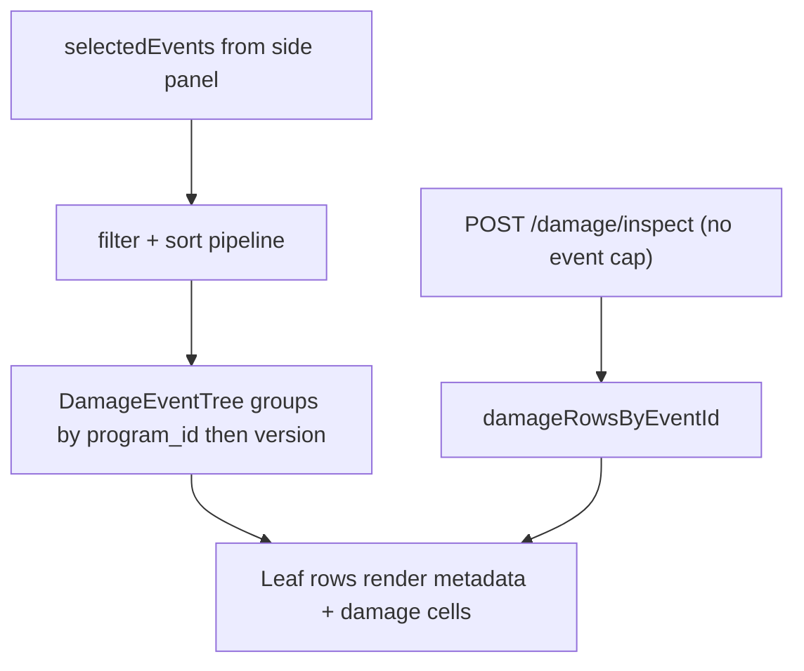

# Inspect Damage Hierarchical Table + Remove Event Cap

## Decisions (grill)

| Topic | Choice |
|-------|--------|
| Tree scope | **Selected events only** — group `selectedEvents` by `program_id` → `version` → event leaves |
| Row checkboxes | **No** — selection stays in side-panel Load Data tree |
| Event limit | **No cap** — remove client guard, server `MAX_DAMAGE_EVENTS`, and the 400 test |

## Goal

Make the Inspect Damage main table visually match [`Dashboard/databasepage.png`](Dashboard/databasepage.png):

- **Program rows**: `bg-muted/60`, chevron, label + `(count)`
- **Version rows**: indented under program (`ml-6 border-l`), white/hover styling, version + `(count)`, empty data/channel cells
- **Event leaves**: further indented (`ml-5 border-l`), metadata columns + Ch01–Ch21 damage values

Keep existing card header, Cols popover, sort/filter/resize on metadata columns, and localStorage prefs from the prior parity work.

## Architecture



## 1. New component: `DamageEventTree`

**Create:** [`Dashboard/client/src/components/damage/DamageEventTree.tsx`](Dashboard/client/src/components/damage/DamageEventTree.tsx)

Adapt row structure and classes verbatim from [`DatabaseEventTree.tsx`](Dashboard/client/src/components/upload/DatabaseEventTree.tsx) (lines 303–518), but **strip all checkbox/selection logic**:

| Level | Classes | First cell content | Data columns |
|-------|---------|-------------------|--------------|
| Program | `py-2 px-3 border-t border-b bg-muted/60 hover:bg-muted/70` | `program_id (N)` | empty spans |
| Version | `py-1.5 px-3 border-b hover:bg-muted/30` + indent math | `version (N)` | empty spans |
| Leaf | `py-1.5 px-3 border-b hover:bg-muted/30` + indent math | `getEventDisplayName(event_id)` | metadata + channel cells via render prop |

Reuse indent constants from Database tree:

- `ROW_PADDING_X_PX = 12`
- `VERSION_INDENT_PX = 25`, `LEAF_INDENT_PX = 21`
- `programRowFirstCellWidth`, `versionRowFirstCellWidth`, `leafRowFirstCellWidth` derived from `programIdWidth`

**Props:**

```tsx
interface DamageEventTreeProps {
  events: EventMetadata[];           // pre-filtered/sorted leaves
  columnDefinitions: ColumnDef[];      // visible metadata cols (job_number, work_order, program_id)
  channelKeys: string[];             // visible Ch** keys
  columnWidths: Record<string, number>;
  programIdWidth: number;
  getColumnValue: (event: EventMetadata, key: string) => string;
  renderChannelCell: (eventId: string, channelKey: string) => React.ReactNode;
}
```

**Tree building:** Group `events` locally (same pattern as [`HierarchicalEventTree`](Dashboard/client/src/components/dashboard/shared/HierarchicalEventTree.tsx) lines 72–88) — no `programVersions` API call needed since scope is selected events only.

**Expand defaults:** Auto-expand all programs on data change (match Database `useEffect` at line 237–240); versions start collapsed until user expands (Database default).

**Single-boundary rule:** Port tail-row `border-b-0` / table-tail divider from DatabaseEventTree so group boundaries don't double-border.

## 2. Update `DamageTable` header layout

**Edit:** [`Dashboard/client/src/app/inspect-damage/page.tsx`](Dashboard/client/src/app/inspect-damage/page.tsx)

Change sticky header to match Database (lines 1119–1138):

1. **First column — "Job ID"** (tree column, `programIdWidth`, resizable via `ColumnResizeHandle`, key `programId` in prefs)
2. **Metadata columns** — existing `renderFilterableColumnHeader` for Job Id / Work Order / Program ID (visible via Cols)
3. **Channel columns** — static Ch** headers

Update `totalRowWidth`:

```tsx
totalRowWidth = programIdWidth + visibleMetadataWidths + visibleChannelWidths
```

Update Cols popover to toggle **metadata + channel columns only** (tree column always visible). Add `programId` to `columnWidths` prefs with default `250` (same as Database `PROGRAM_ID_DEFAULT_PX`).

Replace flat `sortedEvents.map(...)` with:

```tsx
<DamageEventTree
  events={sortedEvents}
  columnDefinitions={visibleMetadataColumns}
  channelKeys={visibleChannelColumns.map(c => c.key)}
  columnWidths={columnWidths}
  programIdWidth={programIdWidth}
  getColumnValue={getColumnValue}
  renderChannelCell={(eventId, channelKey) => /* existing damage cell logic */}
/>
```

Sort/filter pipeline stays unchanged — it runs on the flat event list before grouping.

## 3. Remove 100-event cap

### Client — [`inspect-damage/page.tsx`](Dashboard/client/src/app/inspect-damage/page.tsx)

- Remove `selectedEventIds.length > 100` from `calculateDisabled`
- Remove `limitMessage` / `"Select 100 events or fewer."` from `DamageLoadDataPanel`

### Server — [`server/routers/damage.py`](Dashboard/server/routers/damage.py)

- Delete `MAX_DAMAGE_EVENTS = 100` and the `len(request.event_ids) > MAX_DAMAGE_EVENTS` guard (lines 17–33)

### Test — [`tests/server/routers/test_damage_router.py`](Dashboard/tests/server/routers/test_damage_router.py)

- Remove `test_damage_inspect_rejects_more_than_100_events` (or replace with a smoke test that 101 IDs returns 200 with empty rows if events don't exist — optional, not required)

## What we are NOT doing

- Row checkboxes or table-driven selection
- Full-catalog tree skeleton (only selected events)
- Status badge column (not in damage table today)
- Refactoring `DatabaseEventTree` into a shared base (surgical new component only)

## Verification

1. Select events across multiple programs/versions → table shows gray program rows, indented version rows, leaf rows with damage values.
2. Expand/collapse chevrons work; program/version rows have empty channel cells.
3. Metadata sort/filter/resize still works on leaf rows.
4. Cols popover hides metadata/channel columns; tree column stays.
5. Select 100+ events → Calculate enabled, no client error, server accepts request.
6. Side-panel Load Data selection unchanged.

## Files touched

| File | Change |
|------|--------|
| [`Dashboard/client/src/components/damage/DamageEventTree.tsx`](Dashboard/client/src/components/damage/DamageEventTree.tsx) | **New** hierarchical tree renderer |
| [`Dashboard/client/src/app/inspect-damage/page.tsx`](Dashboard/client/src/app/inspect-damage/page.tsx) | Tree column header, wire `DamageEventTree`, remove 100 cap |
| [`Dashboard/server/routers/damage.py`](Dashboard/server/routers/damage.py) | Remove event count guard |
| [`Dashboard/tests/server/routers/test_damage_router.py`](Dashboard/tests/server/routers/test_damage_router.py) | Remove 100-event rejection test |
