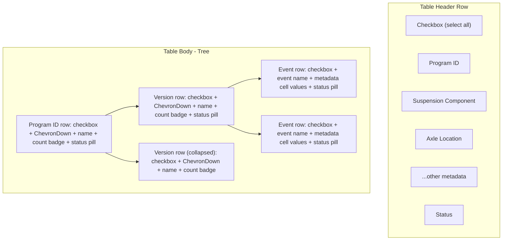

# Database Page: Nested Tree Table Refactor

## Current State

`[client/src/app/database/page.tsx](client/src/app/database/page.tsx)` renders a flat `<Table>` where every event is a row with columns: Event, Program ID, Version, Suspension Component, Axle Location, GVW, Drive Type, Mat'l & Const, Steering, Vehicle Type, [dynamic meta columns], Status.

## Target State

Replace the flat table body with a **nested tree**: **Program ID > Version > Event**. Programs are expanded by default; Versions are collapsed by default. Metadata column values appear only at the Event (leaf) level.

## Design Decisions (Resolved)

- **Metadata columns at Event level only** -- Program/Version rows span the width as tree nodes with name, event count badge, and rolled-up status pill
- **Hierarchical checkboxes** at Program and Version level with indeterminate states (checked/indeterminate/unchecked)
- **Column headers preserved** for metadata columns + Status. A "Program ID" header labels the tree area. "Event" and "Version" columns removed from header
- **Column-level sort** on metadata headers re-orders event leaves within their version groups
- **Server-side pagination unchanged** -- partial tree groups at page boundaries are acceptable
- **Tree pruning on filter** -- if no events match under a version, that version hides; if no versions match under a program, that program hides
- **Toggle icon**: Rotating `ChevronDown` (Lucide)
- **Component**: Radix `Collapsible` (already installed at `[client/src/components/ui/collapsible.tsx](client/src/components/ui/collapsible.tsx)`)
- **Tree indent lines**: Left border connectors (`border-l-2 border-border/40`) matching `HierarchicalEventTree` style
- **Column visibility toggle**: Only metadata columns + Status are toggleable. Program ID and Version are structural (always visible)
- **Empty state**: Reuse existing empty state component when filters prune all results
- **Dedicated new component** in `[client/src/components/upload/](client/src/components/upload/)` -- no coupling with `HierarchicalEventTree`

## Implementation Plan

### 1. Create `DatabaseEventTree` component

New file: `client/src/components/upload/DatabaseEventTree.tsx`

This component accepts:

- `datasets: DatasetRow[]` (already filtered + sorted)
- `selectedDatasets: string[]`, `onSelectDataset`, `onSelectAll`, `isDeletingIds`
- `columnDefinitions` (filtered to visible), `getColumnValue`
- `visibleColumns`, column filter/sort state forwarding

Internal logic:

- **Tree grouping** via `useMemo`: group `datasets` by `displayProgramId` then `displayVersion` into `ProgramGroup[]` (same pattern as lines 188-219 of `[HierarchicalEventTree.tsx](client/src/components/dashboard/shared/HierarchicalEventTree.tsx)`)
- **Expand/collapse state**: `expandedPrograms: Set<string>` (default: all program IDs), `expandedVersions: Set<string>` (default: empty -- collapsed)
- **Hierarchical checkbox logic**: compute `allChecked` / `indeterminate` per program and version using `selectedDatasets`
- **Rolled-up status**: per-program and per-version using worst-case priority (`Obsolete > Pending > Approved`), same logic as `programStatusForBadge` in `HierarchicalEventTree`

Renders:

- **Program row**: `Collapsible` wrapping a `
` with checkbox, rotating `ChevronDown`, program name label, event count badge, status pill. Uses `CollapsibleContent` for children
- **Version row** (nested): Same structure, indented with `ml-6 border-l-2 border-border/40 pl-3`
- **Event row** (leaf): A row with checkbox, event name in the tree column, then `` cells aligned to the metadata column headers using CSS grid or flex

### 2. Refactor `database/page.tsx`

Key changes in `[client/src/app/database/page.tsx](client/src/app/database/page.tsx)`:

- **Remove** `displayEvent` and `displayVersion` from `staticColumnDefinitions` array (lines 226-237). These become tree structure, not columns
- **Remove** `displayEvent` and `displayVersion` from `columnFilters` initial state (lines 197-209) and `visibleColumns` initial state (lines 212-224)
- **Update column header row**: Replace Event and Version `<TableHead>` entries with a single "Program ID" tree header. Keep all metadata column headers with their existing sort/filter controls
- **Replace `<TableBody>` contents**: Swap the flat `sortedDatasets.map(...)` (lines 916-1002) with `<DatabaseEventTree>` component
- **Update `visibleColumnCount**` calculation to account for the tree column replacing Event + Program ID + Version
- **Update `toggleableColumnDefinitions**` to exclude `displayProgramId` (it's structural now)
- **Clean up dead code**: Remove `displayEvent`/`displayVersion` from the `DatasetRow` type if no longer needed elsewhere. Remove the `displayProgramId` column from the visibility toggle popover

### 3. Sorting integration

- Current sort state (`sortField`, `sortDirection`) stays in `page.tsx`
- `sortedDatasets` is already computed before being passed to the table body -- the `DatabaseEventTree` receives pre-sorted events
- Within the tree, events under each version will appear in the order determined by the active sort, since grouping preserves insertion order
- Programs sort alphabetically by default; versions sort alphabetically within their program

### 4. Selection and delete workflow

- `DatabaseEventTree` exposes the same `handleSelectDataset(eventId)` callback
- Add `onBatchSelect(eventIds: string[], checked: boolean)` for program/version-level bulk select
- Wire this into `setSelectedDatasets` in `page.tsx`
- Delete button behavior unchanged -- operates on `selectedDatasets` which are always event IDs

### 5. Clean up unused code

- Remove `displayEvent` and `displayVersion` from `toDatasetRow()` if they become unused
- Remove corresponding entries from `columnFilters`, `visibleColumns`, `displayKeyToServerColumn`
- Prune unused imports (e.g., if certain table sub-components are no longer needed)
- Keep the overall `<Table>` wrapper since column headers + event leaf rows still benefit from table alignment

## Files Changed

| File                                                 | Change                                                      |
| ---------------------------------------------------- | ----------------------------------------------------------- |
| `client/src/components/upload/DatabaseEventTree.tsx` | **New** - tree component                                    |
| `client/src/app/database/page.tsx`                   | Refactor table body, update column defs, clean up dead code |
| `client/src/components/upload/index.ts`              | Export new component (if barrel file exists)                |

