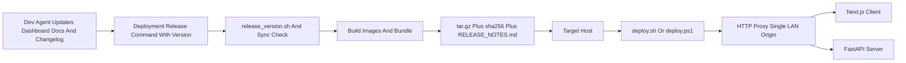

> Superseded: this completed plan is historical context only. Current release
> and deployment guidance lives in `AGENT.md` and `Deployment/README.md`.

# Deployment Simplification Plan

## Decisions From Review

- Keep the top-level [`Deployment/`](Deployment/) flow as primary. It already matches the low-friction handoff model: build on the dev/Linux machine, ship `rsp-dashboard-<VERSION>.tar.gz` plus checksum, then run `deploy.sh` or `deploy.ps1` on the target.
- Do not move the canonical changelog into [`Deployment/`](Deployment/). Keep [`Dashboard/CHANGELOG.md`](Dashboard/CHANGELOG.md) as the product release history because it lives beside the docs/code the LLM should inspect. The bundle should instead include generated operator-facing `RELEASE_NOTES.md` extracted from the current version section.
- Move the deployed stack to a single-origin LAN HTTP model. Add a lightweight reverse proxy service and expose only one host port. Keep TLS out of this first pass to preserve low deployment friction.
- Keep version changes explicit. Add a release command that accepts a SemVer, runs [`Dashboard/scripts/release_version.sh`](Dashboard/scripts/release_version.sh), validates version sync, requires/chases the changelog section, then builds the bundle.
- Use TDD as vertical slices: write one behavior test or smoke check, implement the smallest change to pass it, then move to the next behavior. Do not write all deployment tests up front.

## Target Flow

## Planned Changes

- Release command:
  - First RED behavior: invoking the release command with a valid SemVer calls the existing version workflow, refuses missing changelog coverage, and then delegates to the bundle build.
  - Add a small wrapper in [`Deployment/`](Deployment/) such as `release.sh <version>`.
  - It will run [`Dashboard/scripts/release_version.sh`](Dashboard/scripts/release_version.sh), then verify [`Dashboard/CHANGELOG.md`](Dashboard/CHANGELOG.md) has `## [<version>] - ...`.
  - Keep [`Deployment/build.sh`](Deployment/build.sh) as the lower-level “build whatever `Dashboard/VERSION` says” command, but make the happy path use the release wrapper.

- Bundle release notes:
  - First RED behavior: given a changelog with `## [<version>] - YYYY-MM-DD`, the build extracts only that section into `RELEASE_NOTES.md`; if missing, it fails with an actionable message.
  - Extend [`Deployment/build.sh`](Deployment/build.sh) to add `RELEASE_NOTES.md` into `Deployment/releases/rsp-dashboard-<VERSION>/`.
  - Generate it from the matching version section in [`Dashboard/CHANGELOG.md`](Dashboard/CHANGELOG.md).
  - Update [`Deployment/README.md`](Deployment/README.md), [`AGENT.md`](AGENT.md), and [`hand-off-instructions.md`](hand-off-instructions.md) so the LLM updates `Dashboard/CHANGELOG.md`, while operators read bundled `RELEASE_NOTES.md`.

- Single-origin proxy deployment:
  - First RED behavior: rendered compose exposes only the proxy host port; `server` and `client` have no host `ports:` mappings.
  - Update [`Deployment/docker-compose.yml`](Deployment/docker-compose.yml) to add a proxy service, likely Caddy or nginx in plain HTTP mode.
  - Expose only the proxy host port, with routes like `/api/*` and `/health*` to `server:8000`, and all other paths to `client:3000`.
  - Remove direct host `ports:` from `server` and `client` in the LAN production compose.
  - Keep the existing non-root users, read-only root filesystems, dropped capabilities, health checks, log rotation, volumes, and `jwt-init` pattern.

- Client API base handling:
  - First RED behavior: when same-origin mode is configured, API calls resolve to relative `/api/v1/...` URLs rather than `http://<host>:8000/api/v1/...`.
  - Adjust [`Dashboard/client/src/lib/api/client.ts`](Dashboard/client/src/lib/api/client.ts) so the release build can use same-origin relative API calls cleanly.
  - This avoids browsers needing direct access to port `8000` and removes most CORS friction in the simplified deployment.

- Deploy scripts and docs:
  - First RED behavior: deploy scripts report one dashboard URL and poll readiness through the proxy URL.
  - Update [`Deployment/deploy.sh`](Deployment/deploy.sh) and [`Deployment/deploy.ps1`](Deployment/deploy.ps1) to poll the single proxy URL, print one UI URL, and no longer present separate UI/API LAN ports as the normal path.
  - Keep checksum verification and `.env` validation lightweight.
  - Update docs to show the two-click release/deploy story: `release.sh <version>` on the build host, then `deploy.ps1` or `deploy.sh` on the target.

## TDD Execution Order

1. Release wrapper tracer bullet:
   - RED: add a script-level test or shell harness that proves `release.sh <version>` rejects a missing changelog section after version sync.
   - GREEN: implement the smallest wrapper around [`Dashboard/scripts/release_version.sh`](Dashboard/scripts/release_version.sh) and [`Deployment/build.sh`](Deployment/build.sh).
   - REFACTOR: extract reusable path/version helpers only if the shell scripts start duplicating non-trivial logic.

2. Release notes extraction:
   - RED: test extraction from a small fixture changelog with `[Unreleased]`, target version, and next historical version.
   - GREEN: add a small parser script, preferably in Python for safer structured text handling than shell `sed` ranges.
   - REFACTOR: have [`Deployment/build.sh`](Deployment/build.sh) call that parser and fail hard when notes are missing.

3. Same-origin client behavior:
   - RED: extend the existing client API tests so same-origin mode returns relative URLs while the current LAN-port fallback still works where needed.
   - GREEN: adjust `resolveApiBase()` in [`Dashboard/client/src/lib/api/client.ts`](Dashboard/client/src/lib/api/client.ts).
   - REFACTOR: keep the public API client helpers unchanged so callers do not need to know about proxy mode.

4. Proxy compose behavior:
   - RED: add a compose-rendering check that asserts only the proxy publishes a host port and `/api`/`/health` routes exist in the proxy config.
   - GREEN: add the proxy service and route config in [`Deployment/docker-compose.yml`](Deployment/docker-compose.yml).
   - REFACTOR: remove obsolete `CLIENT_PORT` / `SERVER_PORT` docs from the normal path, preserving compatibility only where it is actually needed.

5. Deploy wrapper behavior:
   - RED: test or dry-run check that deploy output prints one URL and polls through the proxy port.
   - GREEN: update [`Deployment/deploy.sh`](Deployment/deploy.sh) and [`Deployment/deploy.ps1`](Deployment/deploy.ps1).
   - REFACTOR: align Linux and PowerShell wording/variable names after both pass.

## Verification Plan

- Run version sync validation through [`Dashboard/scripts/check_version_sync.py`](Dashboard/scripts/check_version_sync.py).
- Run targeted tests after each TDD slice, not only at the end.
- Run the release wrapper against a test SemVer only after you approve implementation and after its RED/GREEN checks exist.
- Validate Compose rendering for the generated bundle.
- Build images and confirm the generated bundle contains `images.tar`, `docker-compose.yml`, `.env.example`, deploy scripts, `VERSION`, `CHECKSUMS.sha256`, and `RELEASE_NOTES.md`.
- Smoke test the proxy locally: UI at one host port, API reachable through the same origin, health/readiness passing.