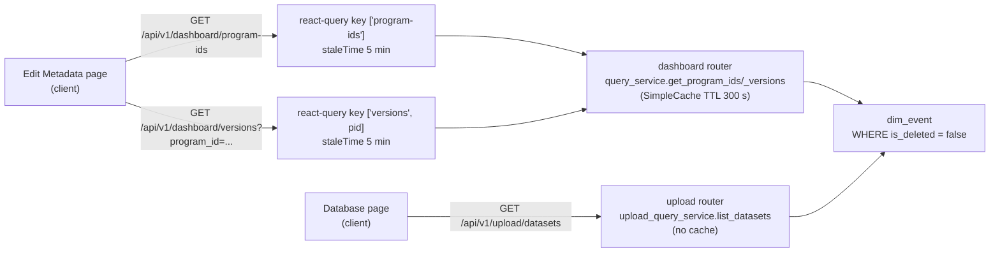

## What the screenshots are showing

- Database page: program `13798` contains only `v04 (8)` events.
- Edit Metadata page: program `13798`'s Version dropdown still offers `v06`, and selecting it even populates a "Current Selection Summary" (Uploaded time 4/7/2026 10:27:48 AM, status Pending).

Those two views disagree because they do NOT query the same thing.

## Two sources of truth (the root cause)




Same underlying table, different paths, different caches. The Database page reads live; the Edit Metadata dropdown reads through two stacked caches (server `SimpleCache` + client React Query) that are only invalidated on **upload**, not on delete/purge.

## Evidence in code

1. Server caches `program-ids` and `versions` for 300 s — [Dashboard/server/config.py](Dashboard/server/config.py) lines 37-38:

```37:40:Dashboard/server/config.py
    program_ids_ttl_seconds: int = 300   # 5 minutes (was 60)
    versions_ttl_seconds: int = 300      # 5 minutes (was 60)
    events_ttl_seconds: int = 120        # 2 minutes (was 30)
```

1. Cache is invalidated on **ingestion only** — [Dashboard/server/services/ingestion.py](Dashboard/server/services/ingestion.py) lines 461-466. `_invalidate_event_cache_groups` also exists in [Dashboard/server/services/query.py](Dashboard/server/services/query.py) lines 459-464 but is only called from metadata update paths.
2. Delete endpoints go **straight to the DB layer**, skipping the service and therefore skipping cache invalidation — [Dashboard/server/routers/upload.py](Dashboard/server/routers/upload.py) lines 409 and 440:

```409:414:Dashboard/server/routers/upload.py
    success = db.soft_delete_event(event_id)
    if not success:
        raise HTTPException(
            status_code=status.HTTP_404_NOT_FOUND,
            detail=f"Event '{event_id}' not found or already deleted",
        )
```

```440:445:Dashboard/server/routers/upload.py
    deleted_count = db.soft_delete_events(target_ids)

    return DeleteEventsResponse(
        deleted_count=deleted_count,
        event_ids=target_ids,
    )
```

1. Purge has the same problem — [Dashboard/server/routers/upload.py](Dashboard/server/routers/upload.py) lines 448-456 calls `db.purge_deleted_events(...)` directly.
2. Client React Query caches for `['program-ids']` and `['versions']` are 5-min stale — [Dashboard/client/src/app/database/edit/page.tsx](Dashboard/client/src/app/database/edit/page.tsx) lines 181-192. They are invalidated only in Edit Metadata's save flow (lines 464-465). The Database page's delete and import flows do NOT invalidate them:

```104:128:Dashboard/client/src/hooks/use-uploaded-datasets.ts
  const deleteDatasets = useCallback(
    async (eventIds: string[]): Promise<boolean> => {
      if (eventIds.length === 0) return false;

      setIsDeletingIds(eventIds);

      try {
        await uploadApi.deleteDatasets(eventIds);
        setDatasets((prev) =>
          prev.filter((d) => !eventIds.includes(d.event_id))
        );
        setTotal((prev) => Math.max(0, prev - eventIds.length));
        return true;
      } catch (err) {
        // ...
```

No `queryClient.invalidateQueries({ queryKey: ['program-ids'] })` / `['versions']` / `['filter-options']` / `['all-events']` here, nor in [Dashboard/client/src/app/database/page.tsx](Dashboard/client/src/app/database/page.tsx) `handleDeleteSelected` (lines 499-519).

1. Even the Database page's tree rolls up by program/version from the **current paginated page only** — [Dashboard/client/src/components/upload/DatabaseEventTree.tsx](Dashboard/client/src/components/upload/DatabaseEventTree.tsx) lines 122-153. A program whose versions straddle two pages will look like it's missing versions on page 0.

## Gaps and inconsistencies (ranked by impact)

- **G1. Delete doesn't invalidate server cache.** `delete_event`, `delete_events`, and `purge_deleted_events` hit `db.*` directly. `program-ids` / `versions` / `events` / `event_count` keep serving rows for up to 300 s after a delete. This is the main cause of the screenshot mismatch.
- **G2. Delete doesn't invalidate client caches.** `useUploadedDatasets.deleteDatasets` and `page.tsx::handleDeleteSelected` never call `queryClient.invalidateQueries` for `['program-ids']`, `['versions']`, `['filter-options']`, or `['all-events']`. Even after server cache clears, the client's 5-min `staleTime` can still hand back stale versions.
- **G3. Import completion only invalidates `['all-events']`.** [Dashboard/client/src/app/database/page.tsx](Dashboard/client/src/app/database/page.tsx) `dbOperation.onImportComplete` (lines 126-146) should also invalidate `['program-ids']`, `['versions']`, and `['filter-options']`.
- **G4. Two endpoints compute "what versions exist" differently.** `/dashboard/versions` says "versions of `dim_event` where `is_deleted=false`", while `/upload/datasets` returns the paginated raw rows and the client re-derives versions from them. A single canonical facet (ideally the already-returned `facets` in `DatasetListResponse`, extended to include `version`) would eliminate the second derivation.
- **G5. Tree groups only the current page.** `DatabaseEventTree` derives programs/versions from the 200-row page slice. Fix by feeding it the server-side `facets` for program/version structure, or by fetching all rows when the user expands a program.
- **G6. Edit Metadata prefill still "works" for a fully-deleted version.** `selectedProgramId/selectedVersion → dashboardApi.getEvents(...)` goes through `events_ttl_seconds = 120 s` cache ([Dashboard/server/services/query.py](Dashboard/server/services/query.py) line 89+). If that was populated before the delete, the Current Selection Summary shows plausible metadata for a version that no longer has any live events — masking the bug. Same G1 fix covers it.

## Proposed fix (smallest-risk path first)

### Step 1 — Invalidate server cache on every write path

In [Dashboard/server/routers/upload.py](Dashboard/server/routers/upload.py) after `db.soft_delete_event`, `db.soft_delete_events`, and `db.purge_deleted_events`, call `query_service._invalidate_event_cache_groups()` (or a small public wrapper). Add `QueryServiceDep` to those three endpoints.

Alternative (cleaner): move the delete/purge business logic into `QueryService` so they live next to `update_program_version_metadata` and share `_invalidate_event_cache_groups`.

### Step 2 — Invalidate client cache on every write path

In [Dashboard/client/src/hooks/use-uploaded-datasets.ts](Dashboard/client/src/hooks/use-uploaded-datasets.ts) `deleteDatasets` success branch, and in [Dashboard/client/src/app/database/page.tsx](Dashboard/client/src/app/database/page.tsx) `onImportComplete`, add:

```ts
queryClient.invalidateQueries({ queryKey: ['program-ids'] });
queryClient.invalidateQueries({ queryKey: ['versions'] });
queryClient.invalidateQueries({ queryKey: ['filter-options'] });
queryClient.invalidateQueries({ queryKey: ['all-events'] });
```

(Pass `queryClient` into the hook, or move the invalidation into the page's delete handler.)

### Step 3 — Make the Database tree authoritative about versions (optional but recommended)

Extend `DatasetListResponse.facets` to include `program_id` and `version` in [Dashboard/server/services/upload_query.py](Dashboard/server/services/upload_query.py) `_FACET_COLUMNS`, and use them in the tree to display the full program/version structure regardless of current page. That also lets us assert in dev mode that `facets.version` for each program matches `/dashboard/versions?program_id=...` — catching any future drift.

### Step 4 — (Optional) Consolidate to one source of truth

Longer term, delete `/dashboard/program-ids` and `/dashboard/versions` and have the Edit Metadata page derive its dropdowns from the same facets endpoint the Database page uses. That permanently removes the possibility of divergence.

## Verification after fix

- Upload a program/version, confirm both pages show it.
- Delete every event for that version, confirm both pages hide it within one request, no 5-minute wait.
- Purge the deleted events, confirm no regression.
- Import a DB backup, confirm Edit Metadata dropdown reflects the new content on the next user interaction, not on timer expiry.

