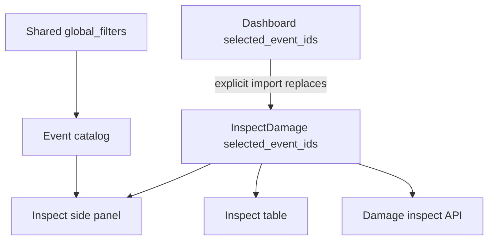

# Inspect Damage Selection Retention

## Resolved UX Decisions

- Use a dedicated Inspect Damage selection, not Dashboard `data_state.selected_event_ids`.
- Add an explicit `Use dashboard selection` action in Inspect Damage.
- Retain Inspect selections for the current app session across route changes and refreshes.
- Persist selected event IDs only, not calculated damage results.
- Keep hidden-by-filter selected events retained, disclose the hidden count, and calculate the full selected queue.
- When importing dashboard selection, replace the Inspect queue and confirm if Inspect already has selections.

## Recommended Product Model

Treat Inspect Damage as a durable route-specific work queue: filters help users find events, but once an event is queued for damage inspection it stays queued until the user clears it, removes it, imports a replacement queue, logs out/resets the session, or the event disappears from the database.

This avoids the current mismatch where Dashboard selections survive navigation but Inspect Damage selections reset on unmount. It also avoids the more dangerous alternative: letting Inspect Damage mutate Dashboard plot selections and create unexpected unrendered plot changes.

## Implementation Shape

- Add a dedicated session payload, e.g. `inspect_damage_state: { selected_event_ids: string[] }`, to:
  - [`Dashboard/client/src/types/session.ts`](Dashboard/client/src/types/session.ts)
  - [`Dashboard/server/models/session.py`](Dashboard/server/models/session.py)
  - [`Dashboard/server/services/session.py`](Dashboard/server/services/session.py)
  - [`Dashboard/server/storage/repositories/sessions_repository.py`](Dashboard/server/storage/repositories/sessions_repository.py)
  - the sessions table schema/source-of-truth docs if a new JSON column is added
- Add a focused client hook, e.g. `useInspectDamageState()`, wrapping `useSession()` so the page does not manually manipulate raw session fields.
- Update [`Dashboard/client/src/app/inspect-damage/page.tsx`](Dashboard/client/src/app/inspect-damage/page.tsx):
  - replace local `useState<string[]>([])` selection with `useInspectDamageState()`
  - remove the current destructive prune effect for Inspect selections
  - compute `hiddenSelectedCount` from selected IDs not present in the current filtered catalog
  - show a clear badge/message such as `N selected hidden by filters`
  - keep `DamageTable` and `Calculate` scoped to the full inspect selected queue
  - keep `damageResponse` local and clear it when the selected queue changes or when the user clears selection
- Add an explicit `Use dashboard selection` affordance near the Inspect `Load Data` controls:
  - disabled/empty state when Dashboard has no selected events
  - confirmation dialog if Inspect already has selections
  - replacement behavior only, not merge
- If selected IDs are hidden by filters but the table must show the full queue, add or reuse an API path/hook to resolve selected event metadata by ID independent of current global filters. Avoid relying only on the filtered `events` list.

## Pros And Cons Of The Chosen Direction

Pros:
- Preserves user work across route navigation and refresh.
- Prevents Inspect Damage from unexpectedly altering the Dashboard plotting workflow.
- Makes filters non-destructive, which is safer for a retained queue.
- Keeps damage results out of session storage, avoiding large persisted payloads.
- Gives users an intentional bridge from Dashboard via `Use dashboard selection`.

Cons:
- Requires a small session model extension rather than a purely local page fix.
- Needs hidden-selection UI so users understand why selected counts may exceed visible filtered rows.
- May require metadata lookup for selected IDs outside the current filtered catalog.
- Slightly more complex than sharing Dashboard `selected_event_ids` directly.

## Verification Targets

- Select events in `/inspect-damage`, navigate to another route, return, and confirm the Inspect selection remains.
- Confirm Dashboard side-panel selection is unchanged by Inspect toggles.
- Click `Use dashboard selection`; confirm it replaces Inspect selection after warning when needed.
- Apply global filters that hide selected Inspect events; confirm selections remain, hidden count appears, table/calculation still use the full queue.
- Clear Inspect selection and confirm the retained queue and local damage response are cleared.