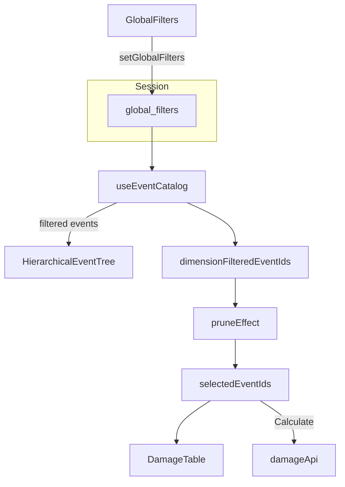

# Inspect Damage: Filter Data Side Panel

## Goal

Match the Dashboard side panel layout on [`/inspect-damage`](Dashboard/client/src/app/inspect-damage/page.tsx):

```text
Filter Data   (GlobalFilters)
─────────────
Load Data     (existing DamageLoadDataPanel + Calculate)
```

Filtering must behave like the Dashboard: same session filters, same catalog narrowing, and checked events on this page auto-deselected when dimension filters hide them.

## Current state

| Area | Dashboard | Inspect Damage today |
|------|-----------|----------------------|
| Filter UI | [`GlobalFilters`](Dashboard/client/src/components/dashboard/side-panel/GlobalFilters.tsx) in [`SidePanel.tsx`](Dashboard/client/src/components/dashboard/side-panel/SidePanel.tsx) | None |
| Filter state | Session `global_filters` via [`useFilterState`](Dashboard/client/src/hooks/use-filter-state.ts) | Already consumed indirectly — page calls [`useEventCatalog()`](Dashboard/client/src/hooks/use-event-catalog.ts), which applies `global_filters` to the event list |
| Load Data | [`LoadDataSection`](Dashboard/client/src/components/dashboard/side-panel/LoadDataSection.tsx) uses session `selected_event_ids` | [`DamageLoadDataPanel`](Dashboard/client/src/app/inspect-damage/page.tsx) uses **local** `selectedEventIds` |
| Selection prune | [`useDashboardWorkspace`](Dashboard/client/src/modules/dashboard-workspace/use-dashboard-workspace.ts) prunes session selection | None |

**Decisions (from grill):**

- **Shared session filters** — reuse `GlobalFilters` / `setGlobalFilters`; no page-local filter state.
- **Keep local selection** — do not switch to session `selected_event_ids`.
- **Prune local selection** — when dimension filters shrink the catalog, remove hidden IDs from `selectedEventIds` (same contract as DEC-037 / dashboard workspace).

## Data flow (after change)



`event_id_query` remains a client-side find tool only (does not prune selection), consistent with [`use-event-catalog.ts`](Dashboard/client/src/hooks/use-event-catalog.ts).

## Implementation (single file focus)

Primary edit: [`Dashboard/client/src/app/inspect-damage/page.tsx`](Dashboard/client/src/app/inspect-damage/page.tsx)

### 1. Side panel layout (mirror Dashboard)

Align expanded panel structure with [`SidePanel.tsx`](Dashboard/client/src/components/dashboard/side-panel/SidePanel.tsx) lines 50–56:

```tsx
<GlobalFilters isCollapsed={sidePanelCollapsed} onExpand={() => setSidePanelCollapsed(false)} />
<div className="py-1">
  <Separator className="bg-border/70" />
</div>
<DamageLoadDataPanel isCollapsed={sidePanelCollapsed} onExpand={() => setSidePanelCollapsed(false)} ... />
```

- Import `GlobalFilters`, `Separator`, `useFilterState`.
- Gate content with `isPanelReady = isSessionReady && !isEventsLoading` (same readiness pattern as Dashboard `SidePanel`).
- Show the same skeleton block while loading (reuse Dashboard skeleton pattern).
- Remove the page’s bespoke collapsed-only `Database` button block; pass `isCollapsed` / `onExpand` into child sections instead (same pattern as `LoadDataSection`).

### 2. Collapsed Load Data affordance

Extend `DamageLoadDataPanel` in the same file with optional props copied from `LoadDataSection`:

- `isCollapsed?: boolean`
- `onExpand?: () => void`

When collapsed, render the ghost `Database` icon button (lines 77–88 of `LoadDataSection.tsx`). `GlobalFilters` already handles the `Filter` icon when collapsed.

### 3. Prune local `selectedEventIds` on filter change

Add a `useEffect` in the page (inline, ~15 lines — no new hook file unless it grows):

- Read `dimensionFilteredEventIds` and `isLoading` from `useEventCatalog()`.
- Read `isSessionReady` from `useFilterState()`.
- Mirror the guard + `lastWhitelistRef` identity check from [`use-dashboard-workspace.ts`](Dashboard/client/src/modules/dashboard-workspace/use-dashboard-workspace.ts) (lines 35–42) so reload does not wipe selection while catalog is loading.
- `setSelectedEventIds((current) => current.filter((id) => dimensionFilteredEventIds.has(id)))` only when length changes.

Do **not** clear `damageResponse` on prune (table already keys off `selectedEvents`; pruned rows simply disappear; user can recalculate if needed).

### 4. No backend changes

`useEventCatalog` already sends dimension filters to `getEvents`; `GlobalFilters` UI is the missing piece.

## Out of scope

- Sharing `selected_event_ids` with Dashboard Load Data.
- Extracting a shared `InspectDamageSidePanel` component (can follow later if database/inspect routes keep diverging).
- Fixing `SidePanelLayout` collapsed opacity (pre-existing: collapsed icon buttons are hidden on Dashboard too).
- New Vitest tests unless you want a small unit test for the prune effect (optional follow-up).

## Verification checklist

1. Open `/inspect-damage` — side panel shows **Filter Data** above a separator, then **Load Data**.
2. Set a dimension filter (e.g. Program) — event tree shrinks; counts in filter accordions match Dashboard.
3. Check events, then tighten filter so they disappear — checks clear automatically.
4. Event ID search narrows the tree but does not deselect hidden-by-search events.
5. Navigate to Dashboard — same global filters still applied (shared session).
6. Collapse panel — chevron expands; Filter/Load icons match Dashboard behavior.
7. Calculate still works with ≤100 selected events after filtering.
