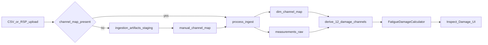

# Lean Plot-Channel Damage Refactor

## Target Model

Inspect Damage becomes a derived view over existing plotted source columns, not a second ingestion path.

Core decisions:

- Use `[Dashboard/server/storage/database.py](Dashboard/server/storage/database.py)` / `[Dashboard/server/schema.yaml](Dashboard/server/schema.yaml)` core tables only for processed data: `dim_event`, `dim_channel_map`, `measurements_raw`, `measurements_lttb`.
- Keep `ingestion_artifacts` only for the existing lenient no-map upload workflow. It is staging/preview/reprocess state, not canonical channel storage.
- Do not add a channel-header registry table. For processed data, `measurements_raw.channel_name` is the channel-header source and `dim_channel_map` is the column-to-plot mapping source.
- Treat CSV and RSP the same after parsing: `.rsp` converts to tagged CSV, `CSVParser` reads `#TITLES`, and `DataTransformer` stores those titles as `measurements_raw.channel_name`.
- Remove branch-only damage storage fields from `measurements_raw`: `channel_key`, `channel_index`, `channel_unit`.
- Remove full-channel damage detection/backfill: `[Dashboard/server/services/damage_backfill.py](Dashboard/server/services/damage_backfill.py)` and `[Dashboard/scripts/backfill_fatigue_channels.py](Dashboard/scripts/backfill_fatigue_channels.py)`.

## Inspect Damage Channel Map

Derive exactly 12 canonical damage columns from the existing 8 plot-pair channel-map entries:

- `BJ X Force` from `bj_xy_force_plot.x_channel` / `x_col`
- `BJ Y Force` from `bj_xy_force_plot.y_channel` / `y_col`
- `BJ Z Force` from `bj_xz_force_plot.y_channel` / `y_col`
- `Shock X Force` from `shock_xy_force_plot.x_channel` / `x_col`
- `Shock Y Force` from `shock_xy_force_plot.y_channel` / `y_col`
- `Shock Z Force` from `shock_xz_force_plot.y_channel` / `y_col`
- `Bushing F X Momt` from `bushing_f_xy_force_plot.x_channel` / `x_col`
- `Bushing F Y Momt` from `bushing_f_xy_force_plot.y_channel` / `y_col`
- `Bushing F Z Momt` from `bushing_f_xz_force_plot.y_channel` / `y_col`
- `Bushing R X Momt` from `bushing_r_xy_force_plot.x_channel` / `x_col`
- `Bushing R Y Momt` from `bushing_r_xy_force_plot.y_channel` / `y_col`
- `Bushing R Z Momt` from `bushing_r_xz_force_plot.y_channel` / `y_col`

Use those canonical labels in the Inspect Damage table. Internally, use stable semantic keys such as `bj_x_force`, `shock_z_force`, `bushing_f_y_momt`, not `ChNN` and not raw CSV labels.

Validate that each component group's XY and XZ plots share the same X channel. If they disagree, mark that group unavailable with a clear configuration error rather than guessing.

## Backend Refactor

- Update `[Dashboard/server/services/etl/transformer.py](Dashboard/server/services/etl/transformer.py)` so `transform_to_long()` only emits the existing long format: `timestamp`, `channel_name`, `value`. Remove damage detection concerns from this transformer.
- Update ingestion paths in `[Dashboard/server/services/ingestion.py](Dashboard/server/services/ingestion.py)` so processed uploads store plot-mapped raw rows only. When saving manual channel maps, resolve `x_channel`/`y_channel` from the parsed CSV headers instead of storing generic `col_N` names where possible.
- Replace `[Dashboard/server/services/query.py](Dashboard/server/services/query.py)` damage query logic: fetch selected events, get their `dim_channel_map`, derive the 12 canonical channels, then query `measurements_raw` by `(event_id, channel_name)`.
- Add a startup idempotent repair in `[Dashboard/server/storage/data_backfills.py](Dashboard/server/storage/data_backfills.py)` that updates generic `dim_channel_map.x_channel/y_channel` values like `col_9` from retained `ingestion_artifacts.preview_json` / parsed headers when available.
- If a legacy generic channel-map value cannot be repaired because no retained preview/header exists, Inspect Damage should return a clear unavailable/configuration status for the affected channel or group.
- Keep `[Dashboard/server/services/fatigue_damage.py](Dashboard/server/services/fatigue_damage.py)` mostly intact, but rename/reshape `ChannelSeries.channel_key` semantics to use the semantic damage key.
- Keep `[Dashboard/server/routers/damage.py](Dashboard/server/routers/damage.py)` API shape if possible (`channel_key`, `channel_name`, damages map), but return semantic keys and canonical labels.

## Schema Cleanup

- Remove `channel_key`, `channel_index`, and `channel_unit` from `[Dashboard/server/schema.yaml](Dashboard/server/schema.yaml)` and `[Dashboard/docs/database-schema.txt](Dashboard/docs/database-schema.txt)`.
- Update `[Dashboard/server/storage/database.py](Dashboard/server/storage/database.py)` inserts/selects for `measurements_raw` to the original columns only.
- Remove or rewrite tests that assert full detected `P_UG_` channel behavior, especially around `[Dashboard/tests/server/services/test_data_transformer.py](Dashboard/tests/server/services/test_data_transformer.py)` and damage query tests.

## Pending Upload Behavior

For uploads without `channel_map.yml`:

- Keep the current staging behavior using `ingestion_artifacts`.
- RSP files may still be converted to tagged CSV for preview/staging.
- Do not create canonical `dim_event` / `measurements_raw` rows until the user saves the channel map.
- After channel-map save, process staged artifacts into the core tables.

This means the user effectively maps first before the data becomes available for dashboard plots or Inspect Damage, while still allowing the UI to accept and preview no-map uploads.

Channel-map editor preview rules:

- Before processing, use `ingestion_artifacts.preview_json` and retained CSV/RSP-converted artifacts for the right-panel preview. This is operational staging only.
- After processing, prefer core data: `dim_channel_map` for the editable left-panel mapping and `measurements_raw.channel_name` / `dim_event.source_file` for header display where needed.
- Do not make `ingestion_artifacts` part of the canonical Inspect Damage query path.

## Verification

- Unit test the 8 plot-pair to 12 damage-channel derivation.
- Unit test strict shared-X validation for BJ, Shock, Bushing F, and Bushing R groups.
- Unit test startup repair from retained artifact preview for generic `col_N` channel-map values.
- Test damage query uses existing `measurements_raw.channel_name` rows and does not require `channel_key`.
- Test no-map staged upload still waits for channel-map save before creating event/measurement rows.
- Run focused backend tests for ingestion, query, damage router, and schema initialization.
- Run frontend type/test checks for Inspect Damage if available.