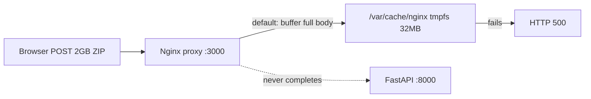

# Nginx streaming upload fix + 60 GB upload limit

## Problem

Large import uploads (`POST /api/v1/export/database/parquet/upload`) fail with **500** at the proxy even though the server has adequate disk and temp configuration.



Root cause in [`Deployment/docker-compose.yml`](Deployment/docker-compose.yml):

- Proxy runs read-only with **`/var/cache/nginx` on a 32 MB tmpfs**
- [`Deployment/nginx.conf`](Deployment/nginx.conf) sets `client_max_body_size 16G` but does **not** disable request buffering
- Nginx tries to spool multi-GB bodies to cache temp space → fails before FastAPI receives the upload

Server-side fixes in 1.3.2 (`TMPDIR=/app/data/tmp`) are correct but irrelevant when the request dies at nginx.

## Solution

### A. Stream uploads through nginx (primary fix)

Add **`proxy_request_buffering off;`** to the `/api/` location so nginx forwards the upload body to the server as it arrives, avoiding multi-GB temp files on the proxy.


### B. Raise end-to-end compressed upload limit to 60 GB

Per operator choice, align **both** layers:

| Layer | Current | New |
|-------|---------|-----|
| Nginx `client_max_body_size` | `16G` | **`60G`** |
| Server `max_upload_size_mb` | `15000` (~14.6 GiB) | **`61440`** (60 GiB, matches nginx `60G`) |

Nginx must be **≥** server limit so the proxy never accepts a file the API would reject.

## Code changes

### 1. Update nginx config

File: [`Deployment/nginx.conf`](Deployment/nginx.conf)

Inside `location /api/ { ... }`:

```nginx
# Allow large Parquet ZIP imports up to 60 GB (must be >= server max_upload_size_mb).
client_max_body_size 60G;

# Stream large multipart uploads to the API instead of buffering on the
# proxy's 32 MB /var/cache/nginx tmpfs (read-only hardened container).
proxy_request_buffering off;
```

Move `client_max_body_size` from the `http`/`server` block into `location /api/` **or** update the existing server-level directive to `60G` (either works; prefer keeping it scoped to `/api/` if other locations don't need 60G).

Keep existing timeout settings:

- `client_body_timeout 1800s`
- `proxy_read_timeout 1800s`
- `proxy_send_timeout 1800s`

No change needed to [`Deployment/docker-compose.yml`](Deployment/docker-compose.yml) tmpfs sizes for this fix.

### 2. Bump server upload limit

Files:

- [`Dashboard/server/settings.docker.yaml`](Dashboard/server/settings.docker.yaml) — production Docker image settings (copied into image at build)
- [`Dashboard/server/settings.yaml`](Dashboard/server/settings.yaml) — dev default
- [`Dashboard/server/settings.yaml.example`](Dashboard/server/settings.yaml.example) — template

Change:

```yaml
max_upload_size_mb: 61440   # 60 GiB — aligns with nginx client_max_body_size 60G
```

Optional env override already supported: `MAX_UPLOAD_SIZE_MB=61440`.

### 3. Update tests

File: [`Deployment/tests/deployment/test_release_tools.py`](Deployment/tests/deployment/test_release_tools.py)

Assert in nginx config test:

```python
self.assertIn("proxy_request_buffering off", nginx_conf)
self.assertIn("client_max_body_size 60G", nginx_conf)
```

File: [`Dashboard/tests/server/routers/test_export_router.py`](Dashboard/tests/server/routers/test_export_router.py)

Update hardcoded `max_upload_size_mb: 15000` expectations if tests assert the info endpoint value.

### 4. Document the fix

- [`Dashboard/CHANGELOG.md`](Dashboard/CHANGELOG.md) — under `[Unreleased]` → **Fixed**:
  - LAN nginx proxy streams large API uploads (`proxy_request_buffering off`) so multi-GB Parquet ZIP imports are not spooled on the proxy's 32 MB cache tmpfs.
  - Raised compressed import upload limit to 60 GB (nginx `client_max_body_size 60G` + server `max_upload_size_mb: 61440`).
- [`Deployment/README.md`](Deployment/README.md) — import section: note streaming through proxy and 60 GB compressed ZIP limit; remind operators that **uncompressed** extraction still needs free space on the `data` volume (~ZIP size + uncompressed size).

## Operator rollout (production host)

**Server image must be rebuilt** if settings.docker.yaml changed (baked at Docker build). **Proxy only needs config reload/recreate.**

```bash
# After deploying new bundle / images
docker compose --env-file .env up -d --force-recreate proxy server
```

Verify:

1. `docker compose --env-file .env exec proxy nginx -t`
2. `GET /api/v1/export/database/info` as admin → `max_upload_size_mb: 61440`
3. Retry **Import Load Data** with ~2 GB ZIP → expect **200** + validation payload
4. Server access log shows `POST .../parquet/upload` with admin `user_id`

## Verification checklist

| Check | Expected after fix |
|-------|-------------------|
| Browser Network tab | `POST .../parquet/upload` → **200** (or **400** for invalid ZIP) |
| Server access log | POST with admin `user_id` |
| Proxy logs | No `No space left on device` during upload |
| `/app/data/tmp` | Staged `.zip` during upload |
| `/api/v1/export/database/info` | `max_upload_size_mb: 61440` |

## Scope boundaries

- **In scope:** nginx streaming, 60 GB compressed limit (nginx + server), tests, changelog, README
- **Out of scope:** uncompressed-size cap during validation, reducing double-extract, host disk expansion beyond current volume
