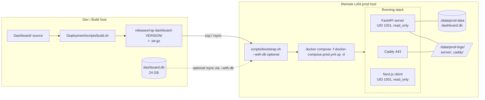

> Superseded: this is historical planning context only. Current release and
> deployment guidance lives in `AGENT.md` and `Deployment/README.md`; the active
> stack is the root `Deployment/` LAN release bundle, not the older Caddy/prod
> compose/bootstrap design described here.

## Final decisions (locked)

- **Mounts**: writables only — source baked into image; only `./data/prod-data` (DB) and `./data/prod-logs` (logs) bind-mounted into the server. Hardening (read_only FS, UID 1001, dropped caps) stays intact.
- **DB migration**: cold copy of `Dashboard/data/dashboard.db` (+ `.wal`) into the prod data dir, chown 1001.
- **Logging tier**: Tier 3 — routed loggers + new HTTP access middleware + slow-query middleware + explicit audit calls in `auth.py`, `export.py`, `upload.py`, plus rate-limit middleware emitting to audit logger.
- **Log layout on disk**: `prod-logs/server/{access,audit,error,app}.log` + `prod-logs/caddy/access.log`.
- **Rotation**: daily; 90 days for operational (`access`, `app`, `error`, `caddy/access`), 365 days for `audit`.
- **Pipeline scope**: portable-bundle approach. Build script + bootstrap script, no registry.
- **Host**: remote LAN. Bundle = release directory (kept on dev) + `.tar.gz` (shipped).
- **DB transfer**: opt-in flag on bootstrap (`./bootstrap.sh --with-db`).
- **Slow-query threshold**: new `slow_query_ms` in `settings.yaml`, default 1000 ms.
- **Grafana**: scaffolded but **fully commented out** in this pass (compose block, Caddy route, README "how to enable later"). Nothing runs. See section F.

## Topology




## File-by-file plan

### A. Compose, Caddy, env (small fixes)

- [Deployment/docker-compose.prod.yml](Deployment/docker-compose.prod.yml)
  - Add a second tmpfs for caddy log buffer is unnecessary; instead **add a `caddy_logs` bind mount** so file logs land on the host:
    ```yaml
    caddy:
      volumes:
        - ./Caddyfile:/etc/caddy/Caddyfile:ro
        - caddy_data:/data
        - caddy_config:/config
        - ./data/prod-logs/caddy:/var/log/caddy
    ```
  - Bump server `pids_limit` justification comment; otherwise unchanged.
  - Add `LOG_TO_FILE=true`, `LOG_DIR=/app/logs`, `SLOW_QUERY_MS=${SLOW_QUERY_MS:-1000}` to server `environment:`.
- [Deployment/Caddyfile](Deployment/Caddyfile): change the global `log` block to write JSON to `/var/log/caddy/access.log` with Caddy's built-in `roll_size`/`roll_keep_for` (90 days):
  ```
  log {
    output file /var/log/caddy/access.log {
      roll_size 50mb
      roll_keep 20
      roll_keep_for 2160h
    }
    format json
  }
  ```
- [Deployment/.env.prod.example](Deployment/.env.prod.example): add `SLOW_QUERY_MS=1000`.

### B. Server logging refactor (Tier 3)

Refactor [Dashboard/server/utils/logging.py](Dashboard/server/utils/logging.py) to:

- Keep the `JsonFormatter` (already good).
- New `setup_logging(level, log_dir, log_to_file)` wires up four `TimedRotatingFileHandler`s under `log_dir/server/`:
  - `access.log` — handler attached to logger name `access`. Daily rotation, `backupCount=90`.
  - `audit.log` — logger name `audit`. Daily, `backupCount=365`.
  - `error.log` — root handler with `level=ERROR`. Daily, `backupCount=90`.
  - `app.log` — root handler with `level=INFO` and a filter that excludes `access`/`audit` logger names (so they don't double-write). Daily, `backupCount=90`.
- Stdout JSON handler stays (so `docker logs` still works).
- Module-level helpers: `get_access_logger()`, `get_audit_logger()`.

New middleware [Dashboard/server/middleware/access_log.py](Dashboard/server/middleware/access_log.py):

- Records request start, generates `request_id` (UUID4) if missing, attaches it to `request.state` and response header `X-Request-Id`.
- On response: emits one `access` log line with `event="http_access", method, path, status_code, duration_ms, ip, user_id` (from JWT if present).
- Skips `/health/live` and `/health/ready` to keep noise down.

New middleware [Dashboard/server/middleware/slow_query.py](Dashboard/server/middleware/slow_query.py) (or extend existing `performance.py`):

- If `duration_ms > settings.slow_query_ms`, emit on logger `app` with `event="slow_request"` and request details.

[Dashboard/server/middleware/rate_limiter.py](Dashboard/server/middleware/rate_limiter.py):

- When a request is rejected, emit on `audit` logger with `event="rate_limit_blocked", ip, path`.

Audit calls to add (Tier 3 instrumentation):

- [Dashboard/server/routers/auth.py](Dashboard/server/routers/auth.py): `event` ∈ {`login_success`, `login_failed`, `logout`, `password_change`, `lockout`}.
- [Dashboard/server/routers/export.py](Dashboard/server/routers/export.py): `event` ∈ {`db_export_started`, `db_export_completed`, `db_import_started`, `db_import_completed`}.
- [Dashboard/server/routers/upload.py](Dashboard/server/routers/upload.py): `event` ∈ {`upload_started`, `upload_validated`, `ingest_completed`, `ingest_failed`}.
- [Dashboard/server/main.py](Dashboard/server/main.py) lifespan: `event` ∈ {`startup`, `migrations_applied`, `shutdown`} on logger `app`.
- Flip `setup_logging(..., log_to_file=settings.log_to_file)` and read new flag from env.

[Dashboard/server/config.py](Dashboard/server/config.py):

- Add `log_to_file: bool = Field(default=False)` (env `LOG_TO_FILE`).
- Add `slow_query_ms: int = Field(default=1000)` (env `SLOW_QUERY_MS`).

### C. Build script — portable bundle

New [Deployment/scripts/build.sh](Deployment/scripts/build.sh):

```bash
#!/usr/bin/env bash
set -euo pipefail
VERSION="$(cat ../Dashboard/VERSION)"
OUT="releases/rsp-dashboard-${VERSION}"
mkdir -p "$OUT"/{images,compose,secrets,scripts}

docker build -t rsp-dashboard-server:"$VERSION" \
  -f ../Dashboard/server/Dockerfile ../Dashboard
docker build -t rsp-dashboard-client:"$VERSION" \
  --build-arg NEXT_PUBLIC_API_URL=https://${DASHBOARD_HOSTNAME:-dashboard.lan}/api \
  -f ../Dashboard/client/Dockerfile ../Dashboard/client
docker pull caddy:2.8.4-alpine

docker save rsp-dashboard-server:"$VERSION" -o "$OUT/images/server-${VERSION}.tar"
docker save rsp-dashboard-client:"$VERSION" -o "$OUT/images/client-${VERSION}.tar"
docker save caddy:2.8.4-alpine             -o "$OUT/images/caddy-2.8.4-alpine.tar"

cp docker-compose.prod.yml Caddyfile         "$OUT/compose/"
cp .env.prod.example                          "$OUT/compose/"
cp -r secrets/*.example secrets/README.md     "$OUT/secrets/"
cp scripts/{bootstrap.sh,up.sh,down.sh,logs.sh,backup.sh} "$OUT/scripts/"
cp README.prod.md "$OUT/"
echo "$VERSION" > "$OUT/VERSION"

( cd "$OUT" && find . -type f ! -name CHECKSUMS.sha256 -exec sha256sum {} + > CHECKSUMS.sha256 )
tar czf "releases/rsp-dashboard-${VERSION}.tar.gz" -C releases "rsp-dashboard-${VERSION}"
echo "Bundle ready: releases/rsp-dashboard-${VERSION}.tar.gz"
```

### D. Bootstrap script (runs on prod host)

New [Deployment/scripts/bootstrap.sh](Deployment/scripts/bootstrap.sh):

- Parse `--with-db <ssh_target:path>` (e.g. `--with-db user@dev:/data/.../Dashboard/data`).
- Verify Docker + compose installed; verify `CHECKSUMS.sha256`.
- `mkdir -p data/prod-data data/prod-logs/server data/prod-logs/caddy`.
- `chown -R 1001:1001 data/prod-data data/prod-logs` (sudo).
- Generate `secrets/jwt_secret` and `secrets/admin_secret` if missing (`openssl rand -hex 32`); `chmod 600`.
- `cp .env.prod.example .env.prod` if missing; print "Edit DASHBOARD_HOSTNAME and IMAGE_TAG before `up.sh`."
- `docker load -i images/*.tar` for all three images.
- If `--with-db` set: `rsync -avP --append-verify <target>/dashboard.db <target>/dashboard.db.wal data/prod-data/` then chown 1001.
- Print final `next steps` checklist.

Companion [scripts/up.sh](Deployment/scripts/up.sh), `down.sh`, `logs.sh`, `backup.sh`: thin wrappers around `docker compose --env-file .env.prod -f compose/docker-compose.prod.yml ...` and a `tar czf` over `data/prod-data` + `data/prod-logs`.

### E. Documentation

Update [Deployment/README.prod.md](Deployment/README.prod.md):

- Replace the `TODO: build script` block with the new `build.sh` workflow.
- Document the bundle layout and the dev → prod transfer (`scp rsp-dashboard-VERSION.tar.gz host:`).
- Document `bootstrap.sh --with-db` for first-time deploy.
- Add "Logging" section describing the file layout, rotation, and how to tail each file.

### F. Grafana stack (commented out, future)

Add the following **commented** block at the bottom of [Deployment/docker-compose.prod.yml](Deployment/docker-compose.prod.yml). Choosing Grafana + Loki + Promtail because we already emit JSON logs to disk in `data/prod-logs/`, so Promtail just tails those files — no app changes required when we flip it on.

```yaml
# ---------------------------------------------------------------------------
# Observability stack (DISABLED for now). To enable later:
#   1. Uncomment the three services, the obs_net network, and the two volumes.
#   2. Uncomment the /grafana/* handle in the Caddyfile.
#   3. Add `grafana_admin_password` to ./secrets/ and to the `secrets:` block.
#   4. Re-run scripts/bootstrap.sh (it will mkdir prod-data/{grafana,loki}).
#   5. docker compose ... up -d
# Resources budgeted: ~700 MB RAM, ~0.5 CPU total. Add to host capacity check.
# ---------------------------------------------------------------------------
#  loki:
#    image: grafana/loki:3.0.0
#    container_name: dashboard-loki
#    restart: unless-stopped
#    user: "10001:10001"
#    networks: [obs_net]
#    volumes:
#      - ./data/prod-data/loki:/loki
#    command: -config.file=/etc/loki/local-config.yaml
#    <<: *security-baseline
#    tmpfs: ["/tmp:size=64M,mode=1777"]
#    pids_limit: 200
#    deploy:
#      resources:
#        limits: { cpus: "0.5", memory: 256M }
#    logging: *default-logging
#
#  promtail:
#    image: grafana/promtail:3.0.0
#    container_name: dashboard-promtail
#    restart: unless-stopped
#    user: "10001:10001"
#    networks: [obs_net]
#    volumes:
#      - ./promtail-config.yaml:/etc/promtail/config.yaml:ro
#      - ./data/prod-logs:/var/log/dashboard:ro     # tail server/*.log + caddy/*.log
#      - promtail_positions:/var/lib/promtail
#    command: -config.file=/etc/promtail/config.yaml
#    depends_on: [loki]
#    <<: *security-baseline
#    tmpfs: ["/tmp:size=32M,mode=1777"]
#    pids_limit: 100
#    deploy:
#      resources:
#        limits: { cpus: "0.25", memory: 128M }
#    logging: *default-logging
#
#  grafana:
#    image: grafana/grafana-oss:11.1.0
#    container_name: dashboard-grafana
#    restart: unless-stopped
#    user: "472:472"
#    networks: [obs_net, app_net]              # app_net so Caddy can reach it
#    volumes:
#      - ./data/prod-data/grafana:/var/lib/grafana
#    secrets: [grafana_admin_password]
#    environment:
#      - GF_SECURITY_ADMIN_PASSWORD__FILE=/run/secrets/grafana_admin_password
#      - GF_SERVER_ROOT_URL=https://${DASHBOARD_HOSTNAME:-dashboard.lan}/grafana
#      - GF_SERVER_SERVE_FROM_SUB_PATH=true
#      - GF_ANALYTICS_REPORTING_ENABLED=false
#      - GF_ANALYTICS_CHECK_FOR_UPDATES=false
#    depends_on: [loki]
#    <<: *security-baseline
#    tmpfs: ["/tmp:size=64M,mode=1777"]
#    pids_limit: 200
#    deploy:
#      resources:
#        limits: { cpus: "0.5", memory: 384M }
#    healthcheck:
#      test: ["CMD", "wget", "--spider", "-q", "http://localhost:3000/api/health"]
#      interval: 30s
#    logging: *default-logging

# Add to top-level networks: when enabling
#  obs_net:
#    driver: bridge
#    internal: true

# Add to top-level volumes: when enabling
#  promtail_positions:

# Add to top-level secrets: when enabling
#  grafana_admin_password:
#    file: ./secrets/grafana_admin_password
```

Add the following **commented** route to [Deployment/Caddyfile](Deployment/Caddyfile) inside the `:443` site, before the catch-all client `reverse_proxy`:

```
    # handle_path /grafana/* {
    #   reverse_proxy grafana:3000 {
    #     header_up X-Forwarded-Proto https
    #     header_up X-Forwarded-Host {host}
    #   }
    # }
```

Also add a commented sibling config file reference in the bundle: `Deployment/promtail-config.yaml.example` (committed only as `.example` so it ships with the bundle but doesn't load until renamed). Minimal scrape config tails `/var/log/dashboard/server/*.log` (labeled `service=server`) and `/var/log/dashboard/caddy/*.log` (labeled `service=caddy`) and pushes to `http://loki:3100`.

[Deployment/scripts/bootstrap.sh](Deployment/scripts/bootstrap.sh) gets a future-only no-op: mention in the printed "next steps" that enabling observability requires re-running bootstrap so it can `mkdir -p data/prod-data/{grafana,loki}` and chown them. Don't actually create those dirs in this pass.

[Deployment/README.prod.md](Deployment/README.prod.md) gets a new section **"Enabling observability (Grafana + Loki + Promtail)"** that lists the 5-step uncomment workflow above, the resource budget, and the URL it'll be served at: `https://${DASHBOARD_HOSTNAME}/grafana`.

## Risks / things to watch

- DuckDB `.wal` must be moved with the `.db`, otherwise the file refuses to open. Cold copy step explicitly copies both.
- Caddy file logging requires the `/var/log/caddy` dir to be writable; bind mount must be created with permissive ownership before first start.
- Tier-3 audit calls touch ~5 router files; needs careful diffing to avoid breaking existing endpoint behavior. Each addition is a single `audit_log.info(event=..., extra={...})` line — non-functional.
- Image bundle is ~1 GB per release — confirm prod host has free disk for current + previous release.
- Grafana stack is **inert** in this pass — no images pulled, no volumes created, no ports opened. It exists only as commented YAML + a README section so future-you doesn't have to re-derive the topology. Adding it later will add ~700 MB RAM and ~0.5 CPU to host requirements.

