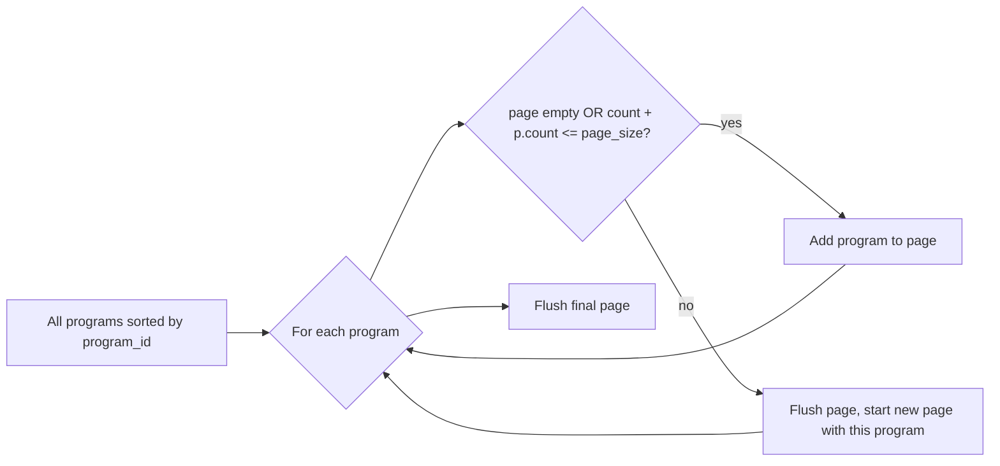

## Algorithm

Sort programs alphabetically by `program_id`. Iterate; add program to current page. If adding the next program would push the page over the target `page_size` AND the page is non-empty, flush the page and start a new one. A single program larger than `page_size` gets its own page (overflow).




## Backend

**[Dashboard/server/services/upload_query.py](Dashboard/server/services/upload_query.py) — `list_datasets**`

- Change signature from `(limit, offset)` to `(page, page_size)`.
- After computing `program_version_rows`, aggregate per-program event counts (sum `event_count` across versions per `program_id`).
- Pack programs into pages with helper:
  ```python
  def _pack_programs(program_counts, page_size):
      pages, cur, cur_n = [], [], 0
      for pid, n in program_counts:
          if cur and cur_n + n > page_size:
              pages.append(cur); cur, cur_n = [pid], n
          else:
              cur.append(pid); cur_n += n
      if cur: pages.append(cur)
      return pages
  ```
- Clamp `page` to `[0, page_count-1]`; if no data, return empty page with `page_count=0`.
- Replace the `LIMIT ? OFFSET ?` query with `WHERE program_id IN (?, ?, ...)`, ordered `ORDER BY program_id, version, created_at DESC` (keep newest-first within each version).
- Filter returned `program_versions` to only the programs on this page (tree shows only page programs).
- Return shape: `{items, total, page, page_size, page_count, page_event_count, has_more, facets, program_versions}`. Drop `limit`, `offset`.

**[Dashboard/server/models/upload.py](Dashboard/server/models/upload.py) — `DatasetListResponse**`

- Replace `limit`, `offset` fields with `page: int`, `page_size: int`, `page_count: int`, `page_event_count: int`. Keep `total` and `has_more`.

**[Dashboard/server/routers/upload.py](Dashboard/server/routers/upload.py) — `GET /upload/datasets**`

- Query params: `page: int = Query(0, ge=0)`, `page_size: int = Query(200, ge=1, le=1000)` (replaces `limit`/`offset`).
- Pass through to service; populate new response fields.

## Frontend

**[Dashboard/client/src/types/upload.ts](Dashboard/client/src/types/upload.ts) — `DatasetListResponse**`

- Replace `limit`, `offset` with `page`, `page_size`, `page_count`, `page_event_count`.

**[Dashboard/client/src/lib/api/upload.ts](Dashboard/client/src/lib/api/upload.ts) — `listDatasets**`

- Change signature to `(page = 0, pageSize = 200, timeoutMs?)` and URL to `?page=${page}&page_size=${pageSize}`.

**[Dashboard/client/src/hooks/use-uploaded-datasets.ts](Dashboard/client/src/hooks/use-uploaded-datasets.ts)**

- Remove `offset` computation.
- Call `uploadApi.listDatasets(page, pageSize, 90_000)`.
- Track and expose `pageCount: number` and `pageEventCount: number`. Drop dead `total`-math. Derive `hasMore` from `page < pageCount - 1` (or trust server).

**[Dashboard/client/src/app/database/page.tsx](Dashboard/client/src/app/database/page.tsx)**

- Replace the footer range display at lines 824–826:
  ```tsx
  <span className="text-xs text-muted-foreground">
    Page {page + 1} of {pageCount} &mdash; {pageEventCount} events
  </span>
  ```
- Replace the Last-page button at line 863 `onClick={() => setPage(Math.ceil(total / pageSize) - 1)}` with `onClick={() => setPage(pageCount - 1)}`.
- Gate pagination footer on `pageCount > 0` instead of `total > 0`.
- Pull `pageCount`, `pageEventCount` from the hook alongside the existing destructure.

**[Dashboard/client/src/components/upload/DatabaseEventTree.tsx](Dashboard/client/src/components/upload/DatabaseEventTree.tsx)**
Every program on the current page is now fully loaded, so the "partial page" ceremony is dead code. Remove:

- `hasPartialPage` / `hasNoPageEvents` calculations (lines 271–274).
- The `[N on page]` span and `title` hint (lines 307–318) — replace that `<span>` with the plain `({vg.totalEventCount})`.
- The `hasNoPageEvents` empty-state message (lines 332–338).

## Tradeoffs / Notes

- `total` stays (used for `currentEventCount` in the side panel/import flow).
- Facets remain global (column-filter dropdowns stay complete across the DB).
- Page size selector (50/100/200/500) keeps its meaning as a "target events per page" — actual page size may exceed it when a single program overflows.
- Behavioral change: users filtering by `Status` column etc. may see a page with zero visible rows if none of the page's programs match. Acceptable — matches current client-side filtering semantics.

