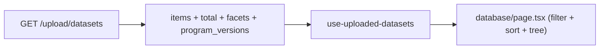

## Scope

Undo the recently-added program-packed pagination and go fully eager. Filtering, sorting, and the tree stay client-side as they are today — they just run over the full dataset every time.




## Backend

**[Dashboard/server/services/upload_query.py](Dashboard/server/services/upload_query.py) — `list_datasets**`

- Drop `page`, `page_size` parameters; `list_datasets(self) -> dict[str, Any]`.
- Delete `_pack_programs` helper.
- Keep: `total`, `facets`, full `program_versions`.
- Events query: `SELECT ... FROM dim_event WHERE is_deleted = false ORDER BY program_id, version, created_at DESC` — no `LIMIT`, no `IN` clause, no program filtering.
- Return only `{items, total, facets, program_versions}`.

**[Dashboard/server/models/upload.py](Dashboard/server/models/upload.py) — `DatasetListResponse**`

- Remove `page`, `page_size`, `page_count`, `page_event_count`, `has_more`.
- Keep `items`, `total`, `facets`, `program_versions`.

**[Dashboard/server/routers/upload.py](Dashboard/server/routers/upload.py) — `GET /upload/datasets**`

- Remove `page` and `page_size` query params. Handler signature becomes:
  ```python
  async def list_datasets(
      upload_query_service: UploadQueryServiceDep,
      _: CurrentUserDep,
  ) -> DatasetListResponse:
  ```
- Response construction drops the page fields.

## Frontend

**[Dashboard/client/src/types/upload.ts](Dashboard/client/src/types/upload.ts) — `DatasetListResponse**`

- Drop `page`, `page_size`, `page_count`, `page_event_count`, `has_more`. Keep `items`, `total`, `facets`, `program_versions`.

**[Dashboard/client/src/lib/api/upload.ts](Dashboard/client/src/lib/api/upload.ts) — `listDatasets**`

- Signature becomes `listDatasets: (timeoutMs?: number) => Promise<DatasetListResponse>`.
- URL: `/api/v1/upload/datasets` (no query string).

**[Dashboard/client/src/hooks/use-uploaded-datasets.ts](Dashboard/client/src/hooks/use-uploaded-datasets.ts)**

- Remove state: `page`, `pageSize`, `pageCount`, `pageEventCount`, `hasMore`.
- Remove `initialPageSize` option, `setPage`, `setPageSize` returns.
- Simplify `fetchDatasets` to `uploadApi.listDatasets(90_000)`.
- Return surface: `datasets, isLoading, isRefreshing, error, refetch, deleteDatasets, isDeletingIds, total, facets, programVersions`.

**[Dashboard/client/src/app/database/page.tsx](Dashboard/client/src/app/database/page.tsx)**

- Remove the entire pagination footer block (the `{pageCount > 0 && ...}` region — page jump buttons and "Page N of M — K events" span).
- Remove the "Rows per page" Select in the table header (lines 685–699 region).
- Drop unused imports: `ChevronLeftIcon`, `ChevronRightIcon`, `ChevronsLeftIcon`, `ChevronsRightIcon`, and the `Select*` family (verify nothing else in this file uses them — currently they're only in the pagination UI).
- Drop `page`, `pageSize`, `pageCount`, `pageEventCount`, `hasMore`, `setPage`, `setPageSize` from the hook destructure.

**[Dashboard/client/src/components/upload/DatabaseEventTree.tsx](Dashboard/client/src/components/upload/DatabaseEventTree.tsx)**

- No changes required — the partial-page hints were removed in the prior iteration, and the tree already handles "all events loaded" as its normal case.

## Tests

**[Dashboard/tests/server/services/test_boundary_regressions.py](Dashboard/tests/server/services/test_boundary_regressions.py)**

- Update `service.list_datasets(page=0, page_size=100)` to `service.list_datasets()`.
- Drop assertions on `page`, `page_count`, `page_event_count`, `has_more`. Keep `total`, `items`, `facets` assertions.

## Notes

- `total` stays because the side panel's `currentEventCount` and the import flow's `useDatabaseOperation` both consume it.
- `facets` remain server-side (already computed globally), so column-filter dropdowns still show every distinct value.
- No safety cap per your answer — the endpoint returns everything in the DB on every call.

