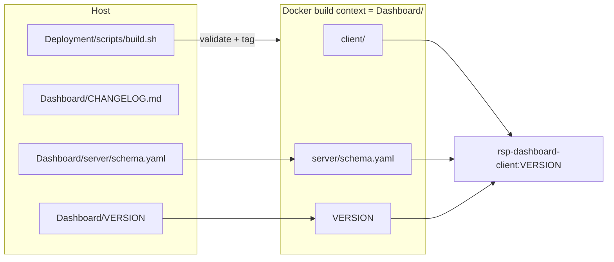

## Root cause (one sentence)

The client image is built with context `Dashboard/client/` while its generator scripts read source-of-truth files that live above that directory (`Dashboard/VERSION`, `Dashboard/server/schema.yaml`), so every new generator silently becomes a Docker landmine.

## Strategy: align client build context with server (Option A1)

Mirror what the server image already does (context = `Dashboard/`). One structural change makes every current and future generator "just work" inside Docker, and lets us delete the ad-hoc fallback patches.




## Concrete changes

### 1. Client Dockerfile: switch to Dashboard/ context

[Dashboard/client/Dockerfile](Dashboard/client/Dockerfile)

- `WORKDIR /app/client` for the deps and builder stages so the relative paths the generators expect (`__dirname/../../VERSION`, `__dirname/../../server/schema.yaml`) resolve naturally.
- `COPY client/package.json client/package-lock.json ./` then `RUN npm ci`.
- `COPY VERSION ../VERSION` and `COPY server/schema.yaml ../server/schema.yaml` (only what generators need; nothing else from server).
- `COPY client/. .` last (cache-friendly).
- Keep `ARG NEXT_PUBLIC_API_URL` as today; remove the `APP_VERSION` ARG/ENV I added — no longer needed.
- Runner stage unchanged except paths under `/app/client/...`.

### 2. Build script: switch context, add release guardrails, drop the per-script build-arg

[Deployment/scripts/build.sh](Deployment/scripts/build.sh)

- Change client `docker build` context from `"$DASHBOARD_DIR/client"` to `"$DASHBOARD_DIR"`.
- Drop `--build-arg APP_VERSION=...` (no longer required).
- Add a `preflight()` step before any `docker build`:
  - Hard fail if `VERSION` is missing or not semver (`^\d+\.\d+\.\d+$`).
  - Hard fail if `server/schema.yaml` is missing or unparseable (`python -c "import yaml,sys; yaml.safe_load(open(sys.argv[1]))" "$DASHBOARD_DIR/server/schema.yaml"`).
  - Warn (not fail) if `Dashboard/CHANGELOG.md` does not contain the current `VERSION` string.
- Print a one-line release header (`==> Release v$VERSION  hostname=$HOSTNAME`).

### 3. Add a top-level Dashboard .dockerignore (new file)

`Dashboard/.dockerignore` — protects the now-wider client context from bloat and accidental server leakage:

```
**/node_modules
**/.next
**/__pycache__
**/.pytest_cache
**/.git
**/.github
**/.cursor
**/.vscode
**/.idea
**/.commits
**/*.log
**/coverage
**/.DS_Store
docs/
notebooks/
data/
logs/
tests/
server/**
!server/schema.yaml
client/.next
client/node_modules
```

The `!server/schema.yaml` line is the only "exception" the client image needs from the server tree; everything else server-side stays out.

### 4. Revert the ad-hoc fallbacks

- [Dashboard/client/scripts/generate-version.js](Dashboard/client/scripts/generate-version.js): drop the `APP_VERSION`/`VERSION` env-var fallback. Single source of truth = `Dashboard/VERSION`, reachable in both dev and Docker.
- [Dashboard/client/scripts/generate-filters.js](Dashboard/client/scripts/generate-filters.js): drop the "use existing filters.ts" silent fallback. Missing schema.yaml should be a hard error, caught earlier by `preflight()` in `build.sh`.

### 5. Release-flow doc (small)

Append a "Release a new version" section to [Deployment/README.md](Deployment/README.md):

```
1. Edit Dashboard/VERSION
2. Add a section to Dashboard/CHANGELOG.md
3. cd Deployment && ./scripts/build.sh
4. Ship releases/rsp-dashboard-<VERSION>.tar.gz to the prod host
```

That is the entire contract. No "remember to also update X."

## What this buys you

- Adding a new generator later? Drop it in `client/scripts/`; if its inputs are anywhere under `Dashboard/`, it works in Docker without `build.sh` touching it.
- Version bump is one file edit; `build.sh` validates it and tags every artifact (image tag, bundle dir, tarball, sha256).
- `preflight()` catches the two real human-error modes (bad VERSION, broken schema) before Docker even starts, so failures are loud and fast instead of mid-`npm run build`.
- No env-var plumbing, no "file may or may not exist" branches in generators, no per-script Docker arguments.

## Out of scope (call out, don't do)

- Host-side generation (Option B). Not needed unless you start sharing generated artifacts across multiple images.
- CI integration. The same `build.sh` is CI-ready as written; wiring a workflow is a separate task.
- Auto-bumping `Dashboard/client/package.json` `"version"` to match `VERSION`. Currently independent; I'd leave it alone unless you want a sync step.

