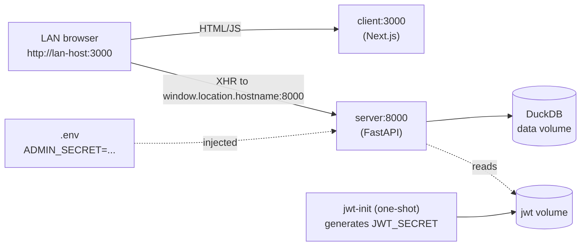

# Simple LAN Deployment

## Goal

A devops engineer gets **two files** (or one tarball containing them):

- `images.tar` — combined `docker save` of `rsp-dashboard-server` + `rsp-dashboard-client`
- `docker-compose.yml` + `.env.example` + `deploy.sh` + `README.md`

They `cp .env.example .env`, set `ADMIN_SECRET`, then `./deploy.sh`. App is up at `http://<lan-host>:3000`. No Caddy, no certs, no `hosts` file edits, no per-environment image rebuilds.

## Architecture (after)



## Code changes (required for the LAN bundle to actually work)

### 1. Relax the server's production-mode HTTPS guardrail

[Dashboard/server/config.py](Dashboard/server/config.py) lines 143-146 hard-rejects `AUTH_COOKIE_SECURE=false` and `cors_origins=["*"]` in production mode. On a trusted LAN both are fine. Add an opt-in escape hatch:

- Add a new field `allow_insecure_cookies: bool = Field(default=False)` (env: `ALLOW_INSECURE_COOKIES`).
- In `validate_production_security`, skip the `auth_cookie_secure` and `cors_origins` wildcard checks when `allow_insecure_cookies=True`.
- All other production guardrails (debug=false, host=0.0.0.0, jwt_secret length, jwt_expiry_hours) stay unchanged.

The default still protects internet-exposed deployments. LAN deployments opt in deliberately by setting `ALLOW_INSECURE_COOKIES=true` in the compose file.

### 2. Make the client's API URL hostname-independent at runtime

[Dashboard/client/src/lib/api/client.ts](Dashboard/client/src/lib/api/client.ts) lines 7-10 read `NEXT_PUBLIC_API_URL` once at module load. Replace with a lazy resolver:

```ts
function getApiBase(): string {
  const fromEnv =
    process.env.NEXT_PUBLIC_API_URL ?? process.env.NEXT_PUBLIC_BACKEND_BASE_URL;
  if (fromEnv) return fromEnv;
  if (typeof window !== 'undefined') {
    return `${window.location.protocol}//${window.location.hostname}:8000`;
  }
  return 'http://localhost:8000';
}
```

Replace every use of the `API_BASE` constant with `getApiBase()` so the call is evaluated per-request, after the browser has a `window`. Audit [Dashboard/client/next.config.ts](Dashboard/client/next.config.ts) for any `NEXT_PUBLIC_API_URL` rewrites that bake the URL at build time and remove them.

Existing build-time `--build-arg NEXT_PUBLIC_API_URL=...` no longer needs to be passed; if it is, it still wins (back-compat).

## Replace `Deployment/` end-to-end

Delete (no longer needed):

- `Deployment/Caddyfile`
- `Deployment/docker-compose.prod.yml` (replaced)
- `Deployment/.env.prod.example` (replaced)
- `Deployment/README.prod.md` (folded into new README)
- `Deployment/secrets/` (jwt-init service + .env replace it)
- `Deployment/scripts/bootstrap.sh`, `up.sh`, `down.sh`, `logs.sh`, `backup.sh`, `_compose_env.sh`
- `Deployment/scripts/deploy.sh`, `deploy.ps1` (replaced by simpler deploy.sh + deploy.ps1)
- `Deployment/scripts/build.sh` (replaced)
- `Deployment/releases/*` (stale bundles — gitignored anyway, but clean local artifacts)

New layout:

- `Deployment/build.sh` — builds the two images, runs `docker save server client -o images.tar`, packs the bundle dir + tarball + sha256.
- `Deployment/docker-compose.yml` — see "Compose shape" below.
- `Deployment/.env.example` — see ".env shape" below.
- `Deployment/deploy.sh` — Linux one-command deploy (lives at repo level AND gets copied into bundle).
- `Deployment/deploy.ps1` — Windows / Docker Desktop equivalent.
- `Deployment/README.md` — short LAN-focused guide.

## Compose shape (`Deployment/docker-compose.yml`)

Three services. Hardening (read_only, cap_drop, no-new-privileges, tmpfs, pids_limit, resource limits) stays — it's free and devops doesn't pay any complexity cost for it.

```yaml
name: rsp-dashboard

services:
  jwt-init:
    image: alpine:3.20
    restart: "no"
    command:
      - sh
      - -c
      - |
        if [ ! -s /secrets/jwt_secret ]; then
          head -c 32 /dev/urandom | od -An -tx1 | tr -d ' \n' > /secrets/jwt_secret
          chmod 600 /secrets/jwt_secret
        fi
    volumes: [ "jwt:/secrets" ]

  server:
    image: rsp-dashboard-server:${IMAGE_TAG:-1.1.0}
    user: "1001:1001"
    ports: [ "${SERVER_PORT:-8000}:8000" ]
    volumes:
      - data:/app/data
      - logs:/app/logs
      - jwt:/run/secrets:ro
    environment:
      - APP_ENV=production
      - HOST=0.0.0.0
      - PORT=8000
      - DATA_ROOT=/app/data
      - LOG_DIR=/app/logs
      - LOG_TO_FILE=true
      - ALLOW_INSECURE_COOKIES=true       # LAN opt-in (see code change #1)
      - AUTH_COOKIE_SECURE=false
      - AUTH_COOKIE_SAMESITE=lax
      - JWT_EXPIRY_HOURS=12
      - CORS_ORIGINS__0=*                  # safe on LAN; allowed because ALLOW_INSECURE_COOKIES=true
      - ADMIN_SECRET=${ADMIN_SECRET:?must set in .env}
    command:
      - sh
      - -c
      - |
        export JWT_SECRET="$$(cat /run/secrets/jwt_secret)"
        exec python -m server
    depends_on:
      jwt-init: { condition: service_completed_successfully }
    healthcheck: # same as today
    # ... security baseline (read_only, cap_drop, etc.) preserved

  client:
    image: rsp-dashboard-client:${IMAGE_TAG:-1.1.0}
    user: "1001:1001"
    ports: [ "${CLIENT_PORT:-3000}:3000" ]
    environment:
      - NODE_ENV=production
      - PORT=3000
      - HOSTNAME=0.0.0.0
      # NEXT_PUBLIC_API_URL intentionally unset → client uses window.location at runtime
    depends_on:
      server: { condition: service_healthy }
    # ... security baseline preserved

volumes:
  data:
  logs:
  jwt:
```

No `Caddyfile`, no Docker `secrets:` block, no `internal: true` networks needed since there's no public-facing edge to isolate.

## `.env` shape (`Deployment/.env.example`)

```env
# REQUIRED: dashboard admin user password.
# Used by Dashboard/server/services/auth.py to authenticate the admin user.
# Change this BEFORE running `./deploy.sh`.
ADMIN_SECRET=changeme

# Optional overrides:
# IMAGE_TAG=1.1.0
# CLIENT_PORT=3000
# SERVER_PORT=8000
```

`JWT_SECRET` is intentionally absent — the `jwt-init` service generates and persists it.

## `deploy.sh` shape

```bash
#!/usr/bin/env bash
set -euo pipefail
cd "$(dirname "$0")"

[[ -f .env ]] || { echo "error: .env missing. Copy .env.example → .env and set ADMIN_SECRET." >&2; exit 1; }
if grep -qE '^ADMIN_SECRET=changeme$' .env; then
  echo "error: ADMIN_SECRET in .env is still 'changeme'. Set a real password." >&2; exit 1
fi

[[ -f images.tar ]] && { echo "==> Loading images"; docker load -i images.tar; }
echo "==> Starting stack"
docker compose --env-file .env up -d

echo "==> Waiting for /health/ready ..."
for _ in $(seq 1 30); do
  code=$(curl -s -o /dev/null -w '%{http_code}' "http://localhost:${SERVER_PORT:-8000}/health/ready" || true)
  [[ "$code" == "200" ]] && { echo "OK. UI: http://$(hostname -f 2>/dev/null || hostname):${CLIENT_PORT:-3000}"; exit 0; }
  sleep 2
done
echo "warning: server not healthy after 60s. Inspect: docker compose logs server" >&2
exit 1
```

`deploy.ps1` mirrors this in PowerShell (same checks, `docker load`, `docker compose up -d`, `curl.exe` health poll). Both scripts ship inside the bundle AND live at `Deployment/` root.

## Build script shape (`Deployment/build.sh`)

Same preflight as today (semver check, schema.yaml parse, CHANGELOG mention) but the build steps shrink:

1. `docker build -t rsp-dashboard-server:$VERSION -f Dashboard/server/Dockerfile Dashboard/`
2. `docker build -t rsp-dashboard-client:$VERSION -f Dashboard/client/Dockerfile Dashboard/`  *(no `NEXT_PUBLIC_API_URL` build-arg needed anymore)*
3. `docker save rsp-dashboard-server:$VERSION rsp-dashboard-client:$VERSION -o releases/rsp-dashboard-$VERSION/images.tar`
4. Copy `docker-compose.yml`, `.env.example`, `deploy.sh`, `deploy.ps1`, `README.md` into the bundle dir.
5. `tar czf releases/rsp-dashboard-$VERSION.tar.gz -C releases rsp-dashboard-$VERSION`
6. `sha256sum > releases/rsp-dashboard-$VERSION.tar.gz.sha256`

No more separate Caddy image to pull, no `secrets/` template copy, no bash `scripts/` subfolder to chmod.

## AGENT.md update

Phases 1, 2 unchanged (`release_version.sh`, CHANGELOG). Phase 3 simplified (one `./build.sh`). Phase 4 collapses to:

```
scp releases/rsp-dashboard-X.Y.Z.tar.gz prod-host:/tmp/
ssh prod-host
sudo tar xzf /tmp/rsp-dashboard-X.Y.Z.tar.gz -C /opt
cd /opt/rsp-dashboard-X.Y.Z
cp .env.example .env && nano .env       # set ADMIN_SECRET
sudo ./deploy.sh
```

Hard rules updated: drop the `IMAGE_TAG=latest` rule (compose file pins to the bundle's version by default), drop the `Caddy hostname` rule (no Caddy), keep the `release_version.sh` and `VERSION/schema.yaml don't delete` rules.

## Trade-offs the operator must understand (document in README)

- **Plaintext HTTP on the LAN.** Anyone who can packet-sniff the LAN can capture session cookies and admin credentials. Same threat model as any internal HTTP intranet app — acceptable on trusted corporate LANs, not acceptable for internet-facing deployments.
- **No CSRF defense from cookie `Secure` attribute.** SameSite=Lax still mitigates most CSRF; for higher-risk LANs add a reverse proxy with HTTPS later.
- **Admin password lives in `.env` on disk.** Restrict file permissions (`chmod 600 .env`) and treat the host like any other secrets-bearing machine.
- **Hostname-independent client only works in the browser.** Server-side rendering still falls back to `http://localhost:8000` (which is correct inside the Docker network if it ever needs to reach itself, but worth knowing).