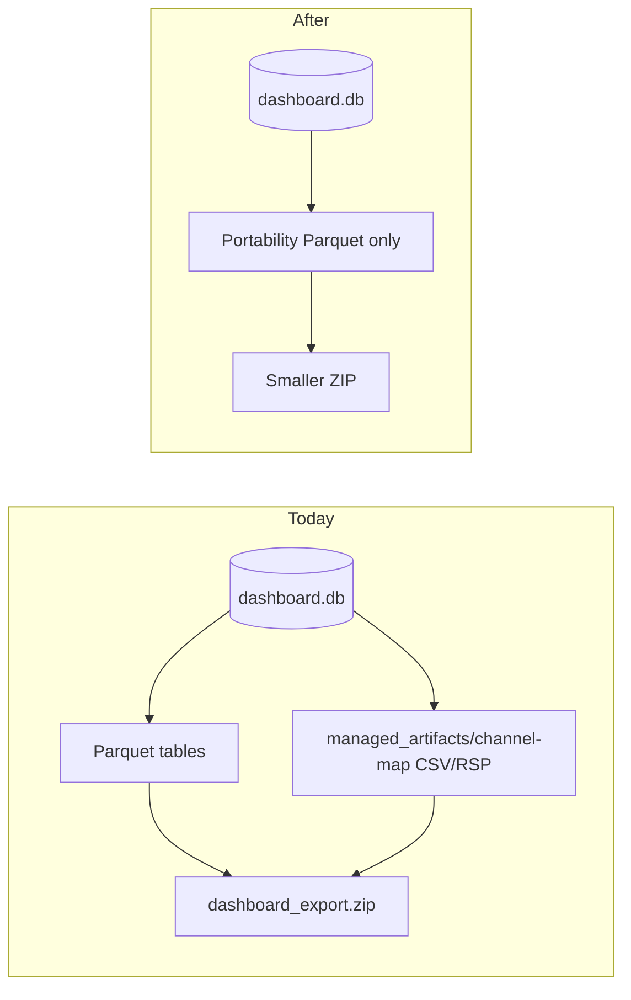

# Slim load-data export (no retained CSV files)

## Current behavior

Yes — today export **fully copies** retained upload files:

```493:497:Dashboard/server/services/export.py
            self.db.export_to_parquet(export_dir, on_progress=on_progress)
            artifact_root = self.settings.data_root / "artifacts" / "channel-map"
            if artifact_root.exists():
                target = export_dir / "managed_artifacts" / "channel-map"
                shutil.copytree(artifact_root, target, dirs_exist_ok=True)
```

Import mirrors that with `copytree` into `data/artifacts/channel-map` after DB swap ([`export.py`](Dashboard/server/services/export.py) ~783–872). This is intentional per [DEC-041](Dashboard/docs/decisions/log.md) but explains your **~2 GiB ZIP / ~24 GiB extract** (Parquet ~2 GiB + `managed_artifacts` bulk).

Parquet export also includes the full [`ingestion_artifacts`](Dashboard/server/storage/database.py) table via `LOAD_DATA_TABLES`, which indexes those filesystem paths.



## Target behavior (your choice: drop pending)

**Portable export/import = processed load data only.**

| Included | Excluded |
|----------|----------|
| `dim_program`, `dim_event`, `dim_channel_map` | `managed_artifacts/**` (all retained CSV/RSP bytes) |
| `measurements_raw`, `measurements_lttb`, `event_custom_field_values` | `ingestion_artifacts` rows (pending/failed/processed metadata) |
| `schema.sql`, `load.sql`, `_schema_metadata` | Re-process-from-retained-file on target after map edit |

Pending/no-channel-map work stays **source-local**; target gets plottable data after import. Operators who need pending uploads on another host must finish channel-map setup on source first, or re-upload on target.

## Implementation

### 1. Define portability table set

In [`Dashboard/server/storage/database.py`](Dashboard/server/storage/database.py):

- Add `LOAD_DATA_PORTABILITY_TABLES`: same as `LOAD_DATA_TABLES` **minus** `ingestion_artifacts`.
- Keep `LOAD_DATA_TABLES` and `LOAD_DATA_DELETE_ORDER` unchanged so import still **clears** target `ingestion_artifacts` (and artifact files on target remain managed separately on that host).

### 2. Export path

[`export_to_parquet`](Dashboard/server/storage/database.py):

- Iterate `LOAD_DATA_PORTABILITY_TABLES` for `COPY`, `schema.sql` indexes, and `load.sql` generation (not full `LOAD_DATA_TABLES`).

[`ExportService._run_export`](Dashboard/server/services/export.py):

- **Remove** `shutil.copytree` for `managed_artifacts/channel-map`.
- Optional log/progress line: portable export excludes retained upload files.

### 3. Import path

[`ExportService._run_import_guarded`](Dashboard/server/services/export.py):

- **Remove** extract → `staged-channel-map` → restore `artifacts/channel-map` block (~783–872).
- During ZIP extract, **skip** members under `managed_artifacts/` so old archives with large trees do not inflate disk (~24 GiB) on extract ([`extract` loop](Dashboard/server/services/export.py) ~722–756).

[`import_from_parquet`](Dashboard/server/storage/database.py):

- Require Parquet files for `LOAD_DATA_PORTABILITY_TABLES` only (not `ingestion_artifacts.parquet`).
- Load loop: `for table in LOAD_DATA_PORTABILITY_TABLES` (delete phase still uses `LOAD_DATA_DELETE_ORDER` including `ingestion_artifacts`).
- Adjust `total_steps` in progress: `len(DELETE_ORDER) + len(PORTABILITY_TABLES) + 1` (14 steps when backup skipped, down from 15).

[`validate_import_zip`](Dashboard/server/services/export.py):

- `missing_load_tables` check against `LOAD_DATA_PORTABILITY_TABLES`.
- Reject archives that **require** `ingestion_artifacts.parquet` for new format; tolerate **extra** `ingestion_artifacts.parquet` in legacy zips only if we do not reference it in `load.sql` (new exports won't).

### 4. Tests

[`Dashboard/tests/server/services/test_export_service.py`](Dashboard/tests/server/services/test_export_service.py):

- Assert export dir has **no** `managed_artifacts/` tree.
- Assert **no** `ingestion_artifacts.parquet` in portable export.
- Round-trip tests unchanged for events/measurements/channel maps.
- Update `test_load_data_import_reports_granular_progress` expected `total_steps` (15 → 14).
- Add test: ZIP containing `managed_artifacts/large.bin` skips extract of that prefix (path not created).

Optional: fixture with pending artifact row + file on disk → export → confirm row/file not in ZIP.

### 5. Documentation and decisions

- Update [DEC-041](Dashboard/docs/decisions/log.md) with a new entry (e.g. **DEC-0XX**) superseding portable inclusion of managed artifact files.
- Update [`Dashboard/docs/brainstorm/07_database_import/00_OVERVIEW.md`](Dashboard/docs/brainstorm/07_database_import/00_OVERVIEW.md), [`Deployment/README.md`](Deployment/Deployment/README.md), [`CHANGELOG.md`](Dashboard/CHANGELOG.md) [Unreleased]: portable export size, pending uploads not transferred.
- [`Dashboard/docs/tasks/P2-13.md`](Dashboard/docs/tasks/P2-13.md) note: portability no longer includes `managed_artifacts`.

### 6. UI copy (optional, small)

[`DatabaseOperationModal`](Dashboard/client/src/components/upload/DatabaseOperationModal.tsx) or export confirm text: one line that load-data export transfers **processed** data only; pending channel-map uploads stay on this system.

## Backward compatibility

| Archive type | Behavior |
|--------------|----------|
| **New export** | No `managed_artifacts/`, no `ingestion_artifacts.parquet`; much smaller ZIP/extract |
| **Old export** (has `managed_artifacts/`) | Import **does not extract or restore** those paths; Parquet load still works if tables match |
| **Old export** (includes `ingestion_artifacts.parquet`) | Ignored if absent from new `load.sql`; if present in old `load.sql`, narrow to only load portability tables in code path above |

## Risk / operator note

After import on target, users will **not** see source pending versions that only existed as retained artifacts. Processed programs/events/channel maps and measurements behave as today. Document clearly in export/import UI and Deployment README.
