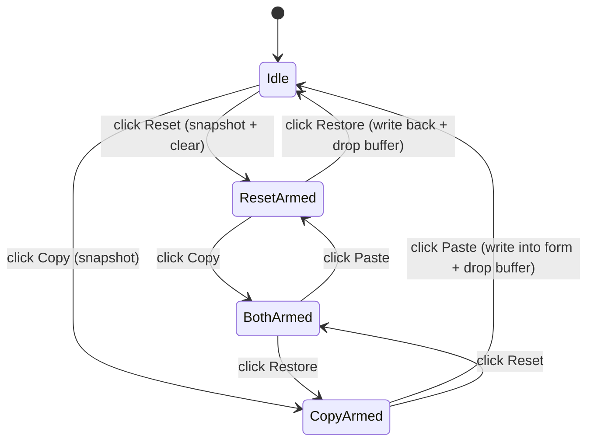

## Goal

In the top toolbar of the data table card (where `Columns` and `Delete` live), add a **Copy** button and a **Reset** button to the left of `Delete`. Both are one-shot, in-memory toggles:

- **Reset** snapshots the current metadata form values and clears them; its label/icon becomes **Restore**. Clicking Restore writes the snapshot back and flips it back to Reset.
- **Copy** snapshots the current metadata form values; its label/icon becomes **Paste**. Clicking Paste writes the snapshot into the form and flips it back to Copy.
- Both buffers are scoped to **all metadata fields except the four identifier fields**: `Program ID`, `Load Version`, `Job Number`, `Work Order`. Those four are never touched by Reset, Restore, Copy, or Paste.
- Both buffers live in `useState` only (no localStorage); a reload clears them.
- The existing `Clear` link in the `UploadDataSection` header is removed.

## Files touched

- [Dashboard/client/src/app/database/page.tsx](Dashboard/client/src/app/database/page.tsx) — add state + handlers, render the two new buttons in the toolbar, stop passing `hasActiveFilters`/`onClearFilters` to the side panel.
- [Dashboard/client/src/components/upload/UploadDataSection.tsx](Dashboard/client/src/components/upload/UploadDataSection.tsx) — remove the `Clear` header action and the two related props.

No API, no server changes.

## State & helpers (in `DatabasePage`)

```tsx
const IDENTIFIER_FIELDS = ['Program ID', 'Load Version', 'Job Number', 'Work Order'] as const;

type FilterSnapshot = Record<string, string>;
const [resetBuffer, setResetBuffer] = useState<FilterSnapshot | null>(null);
const [copyBuffer, setCopyBuffer]   = useState<FilterSnapshot | null>(null);
```

- `snapshotNonIdentifiers(filters)` returns a new object with every key in `filters` except the four identifiers.
- `isNonIdDefault(key, value)` treats `Status === 'Pending'` as empty, every other field as empty when `value === ''`.
- `hasNonIdValues(filters)` = `Object.entries(filters).some(([k, v]) => !IDENTIFIER_FIELDS.includes(k) && !isNonIdDefault(k, v))`.
- `clearedNonIds(filters)` returns a patch mapping every non-identifier key to `''`, except `Status` → `'Pending'`.

## Handlers

- **Reset** (enabled when `hasNonIdValues(filters)` and `resetBuffer === null`):
  1. `setResetBuffer(snapshotNonIdentifiers(filters))`
  2. `setFilters(prev => ({ ...prev, ...clearedNonIds(prev) }))`
- **Restore** (shown when `resetBuffer !== null`, always enabled while shown):
  1. `setFilters(prev => ({ ...prev, ...resetBuffer }))`
  2. `setResetBuffer(null)`
- **Copy** (enabled when `hasNonIdValues(filters)` and `copyBuffer === null`):
  1. `setCopyBuffer(snapshotNonIdentifiers(filters))`
- **Paste** (shown when `copyBuffer !== null`, always enabled while shown):
  1. `setFilters(prev => ({ ...prev, ...copyBuffer }))`
  2. `setCopyBuffer(null)`

Reset and Copy are independent — having one buffer full never disables the other pair.

## Decision flow




## UI placement

In `database/page.tsx`, inside the toolbar div at roughly lines 678–755, insert the two buttons between the `Columns` popover and the `Delete` button, in the order `Copy | Reset`:

```tsx
<Button variant="outline" size="sm" onClick={copyBuffer ? handlePaste : handleCopy}
        disabled={copyBuffer ? false : !hasNonIdValues(filters)}
        className="h-8 rounded-lg px-3 gap-2">
  {copyBuffer ? <ClipboardPaste className="h-4 w-4" /> : <Clipboard className="h-4 w-4" />}
  <span className="text-xs">{copyBuffer ? 'Paste' : 'Copy'}</span>
</Button>
<Button variant="outline" size="sm" onClick={resetBuffer ? handleRestore : handleReset}
        disabled={resetBuffer ? false : !hasNonIdValues(filters)}
        className="h-8 rounded-lg px-3 gap-2">
  {resetBuffer ? <RotateCw className="h-4 w-4" /> : <RotateCcw className="h-4 w-4" />}
  <span className="text-xs">{resetBuffer ? 'Restore' : 'Reset'}</span>
</Button>
```

Icons come from `lucide-react` (already used across the file): `Clipboard`, `ClipboardPaste`, `RotateCcw`, `RotateCw`.

## Side-panel cleanup

In [Dashboard/client/src/components/upload/UploadDataSection.tsx](Dashboard/client/src/components/upload/UploadDataSection.tsx):

- Delete the `clearFiltersAction` block (lines 105–115) and stop passing `headerActions` into `SidePanelSection`.
- Remove `hasActiveFilters` and `onClearFilters` from `UploadDataSectionProps` and the function signature.

In [Dashboard/client/src/app/database/page.tsx](Dashboard/client/src/app/database/page.tsx):

- Stop passing `hasActiveFilters` and `onClearFilters` inside `uploadDataProps` (lines 657–658).
- Keep the internal `clearFilters()` function and `hasActiveFilters()` — they are still called from `useUpload.onComplete` (line 283) and `dbOperation.onImportComplete` reset flow (line 127). They just no longer drive a side-panel button.

## Edge cases handled

- **Non-admin Status**: Status is locked to `'Pending'` for non-admins and treated as the empty default by `isNonIdDefault`, so it never makes Copy/Reset look "active" by itself, and Paste/Restore writing `'Pending'` is a no-op for non-admins.
- **Upload success** invalidates filters via the existing `clearFilters()` call. Any pending `resetBuffer`/`copyBuffer` intentionally survives until reload — the user may want to paste into another new version right after uploading. (If you'd rather clear them on successful upload, that's a one-line change in the two `onComplete` callbacks; flag it and I'll add it.)
- **Dynamic metadata fields** (Suspension Component, Axle Location, etc.) are filled into `filters` by key, so the snapshot-by-key logic covers them automatically with no per-field list to maintain.

